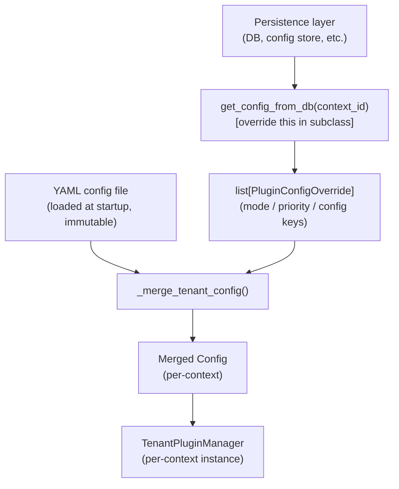
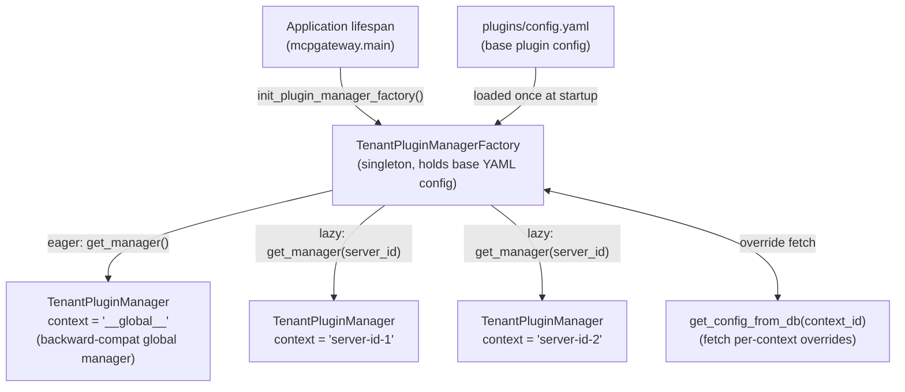
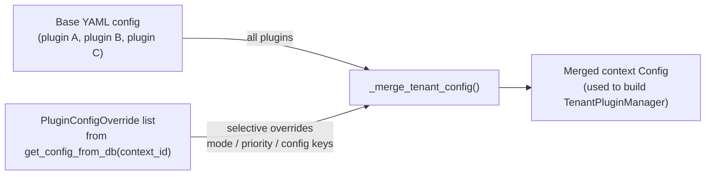
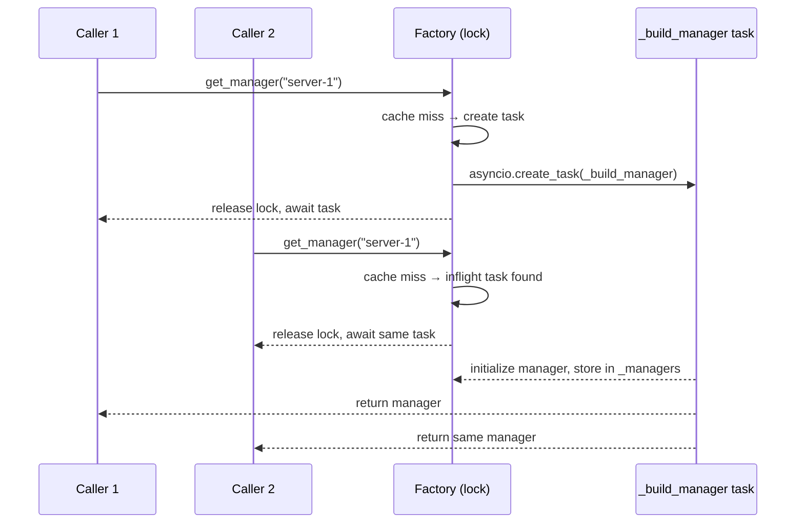

# Plugin Manager Multi-Tenancy Architecture

## Overview

The plugin subsystem supports **context-scoped isolation** through a shared `TenantPluginManagerFactory`. Each resolved context gets its own `TenantPluginManager` instance with an independently merged plugin configuration, while the default `__global__` context continues to serve non-context-aware call sites.

The factory is intentionally **context-agnostic**. The identifier passed to `get_manager()` can represent a virtual server, tenant, tool, user, or another scoping key. The factory does not interpret the value; it only uses it to:
- look up an existing cached manager,
- fetch optional configuration overrides via `get_config_from_db(context_id)`,
- build and initialize a `TenantPluginManager`,
- cache the result for reuse.

In the current gateway wiring, the primary runtime usage is:
- `get_plugin_manager()` or `get_plugin_manager("__global__")` for shared/global plugin execution
- `get_plugin_manager(server_id)` for server-scoped execution in services such as tools, prompts, and resources

---

## Plugin Configuration Lifecycle

### Startup: YAML is the source of truth

Plugins must be **declared in the YAML configuration file at startup**. The YAML defines which plugins exist, their default `mode`, `priority`, and plugin-specific `config` keys. This base configuration is loaded once by `TenantPluginManagerFactory` and is **immutable at runtime** — it cannot be changed without a restart.

```yaml
plugins/config.yaml
  └─ plugin A  (mode: enforce, priority: 10, config: {...})
  └─ plugin B  (mode: permissive, priority: 20, config: {...})
```

Only plugins listed in the YAML participate in any context. There is no mechanism to introduce entirely new plugins at runtime.

### Runtime: per-context overrides via `PluginConfigOverride`

For each context (e.g. a virtual server), the factory may apply a list of `PluginConfigOverride` objects on top of the base YAML config. An override can:

- **change a plugin's `mode`** (e.g. promote from `permissive` to `enforce` for a specific server)
- **change a plugin's `priority`** (re-order execution within the chain)
- **add or replace keys in the plugin's `config` dict** (deep custom configuration)

Overrides are **additive and selective**: only the fields explicitly set in an override are applied; everything else inherits the YAML base. A plugin not mentioned in the override list is used as-is.

```yaml
PluginConfigOverride
  └─ name: "plugin A"
  └─ mode: permissive       # overrides YAML value for this context
  └─ config: {threshold: 5} # merged on top of base config
```

### Fetch hook: `get_config_from_db`

`get_config_from_db(context_id)` is the extension point that translates a context identifier into a list of `PluginConfigOverride` objects fetched from persistent storage.

The base implementation always returns `None` (no overrides). Subclasses override this method to query the database — or any other store — for the per-context plugin settings associated with `context_id`.

The returned overrides are passed directly to `_merge_tenant_config`, which walks the base config's plugin list and applies each override: per-plugin `config` dicts are shallow-merged (override keys win), and optional `mode` and `priority` fields replace the base values when present. The result is a new `Config` object used to construct an isolated `TenantPluginManager` for that context.

In summary: `get_config_from_db` is the seam between the factory and your persistence layer — override it to make per-context plugin configuration dynamic.



---

## Architecture Summary



### Main components

- **`PluginManager`**: legacy Borg-style manager with shared state across instances.
- **`TenantPluginManager`**: `PluginManager` subclass that disables Borg behavior and keeps fully independent state per instance.
- **`TenantPluginManagerFactory`**: async-safe cache/factory for per-context managers.
- **`get_plugin_manager()`**: global accessor in `mcpgateway.plugins.framework.__init__` that returns a context manager from the singleton factory when plugins are enabled.

---

## Current Runtime Behavior

### Startup

At startup, `mcpgateway.main.lifespan()`:

1. enables the plugin subsystem when configured,
2. initializes the global `TenantPluginManagerFactory` with:
   - YAML config path,
   - plugin timeout,
   - hook payload policies,
   - optional observability provider,
3. calls `await get_plugin_manager()` to resolve the default `__global__` manager,
4. leaves additional context-specific managers to be created lazily on first use.

This means the factory is initialized eagerly, but most tenant/server managers are initialized on demand.

### Request-time resolution

Services that support context scoping call `get_plugin_manager(server_id)` and receive:
- a cached `TenantPluginManager`, or
- a newly built and initialized one for that context.

Call sites that do not provide a context ID continue to use the default global manager.

---

## Core Types

### `PluginManager`

`PluginManager` remains the base implementation and still uses the Borg pattern.

| Property | Current behavior |
| --- | --- |
| State model | Shared `__dict__` across instances |
| Primary role | Legacy/global compatibility |
| Initialization | Loads YAML config and shares registry/executor state |
| Reset path | `PluginManager.reset()` clears shared Borg state |

### `TenantPluginManager`

`TenantPluginManager` inherits the public API from `PluginManager` but bypasses the Borg initialization path.

| Property | Current behavior |
| --- | --- |
| State model | Independent per instance |
| Config source | Either a `Config` object or YAML path |
| Registry | Dedicated `PluginInstanceRegistry` per manager |
| Executor | Dedicated `PluginExecutor` per manager |
| Locking | Own async init/shutdown lock per manager |

`enable_borg()` is overridden as a no-op, so tenant managers do not share state.

### `TenantPluginManagerFactory`

Defined in `mcpgateway/plugins/framework/manager.py`.

| Method | Current behavior |
| --- | --- |
| `get_manager(context_id=None)` | Returns cached manager or creates one; defaults to `__global__` |
| `_build_manager(context_id)` | Fetches overrides, merges config, initializes manager, swaps cache entry |
| `_merge_tenant_config(overrides)` | Applies per-plugin override values on top of base YAML config |
| `reload_tenant(context_id)` | Evicts cached manager, rebuilds it, and shuts down the old one |
| `shutdown()` | Cancels in-flight builds and shuts down all cached managers |
| `get_config_from_db(context_id)` | Extension hook; returns `None` in the base implementation — **subclass to enable DB-backed overrides** |

---

## Accessor Layer

The public accessor lives in `mcpgateway/plugins/framework/__init__.py`.

| Function | Current behavior |
| --- | --- |
| `enable_plugins(toggle)` | Enables or disables the plugin subsystem globally |
| `init_plugin_manager_factory(...)` | Creates the singleton factory explicitly during startup |
| `get_plugin_manager(server_id="__global__")` | Returns a context manager when plugins are enabled and the factory exists |
| `shutdown_plugin_manager_factory()` | Shuts down the factory and clears the singleton reference |
| `reset_plugin_manager_factory()` | Clears the singleton reference for tests |

### Important clarification

The accessor **does not lazy-initialize the factory**. If the factory was not initialized during startup, `get_plugin_manager()` returns `None`.

---

## Configuration Merge Model

Each context starts from the base YAML plugin config and optionally applies a list of `PluginConfigOverride` objects returned by `get_config_from_db(context_id)`.

Only plugins already present in the base config participate in the merge. There is no mechanism to introduce new plugins at runtime; the YAML is the canonical plugin registry.

For each matching plugin:

- `config` is shallow-merged: `{**base.config, **override.config}` — override keys win
- `mode` is replaced only if provided in the override
- `priority` is replaced only if provided in the override

Plugins not mentioned in the override list remain unchanged. Passing `None` overrides means: use the base config as-is.



---

## Concurrency Model

Manager creation is deduplicated per context through `_inflight`.

When multiple coroutines ask for the same context manager concurrently:

1. the first caller acquires the lock and creates `_build_manager(context_id)` as an `asyncio.Task`,
2. the task is stored in `_inflight[context_id]` and the lock is released,
3. later callers acquiring the lock find the existing task and await it,
4. once the task completes, `_build_manager` stores the result in `_managers` under the lock,
5. `get_manager` re-checks `_managers` after the await to pick up any replacement triggered by a concurrent `reload_tenant`,
6. the task is removed from `_inflight` in a `finally` block.

This ensures only one initialization path runs per context at a time, and concurrent callers share the result rather than racing to build duplicate managers.



---

## Reload and Shutdown Semantics

### Reload

`reload_tenant(context_id)`:

1. acquires the lock and removes the cached manager for the context,
2. cancels any existing in-flight build task for the same context,
3. creates a fresh `_build_manager` task and stores it in `_inflight`,
4. releases the lock and shuts down the old manager outside it,
5. awaits the new task and returns the rebuilt manager.

### Shutdown

`shutdown()`:

1. snapshots cached managers and in-flight tasks under the lock,
2. clears both caches atomically,
3. cancels all in-flight tasks,
4. awaits their completion (collecting exceptions),
5. shuts down each cached manager.

This keeps teardown orderly without leaving active manager instances behind.

---

## Backward Compatibility

The current design preserves compatibility in a few important ways:

- `PluginManager` still exists for Borg-based shared-state behavior.
- `TenantPluginManager` keeps the same public lifecycle and hook invocation API as `PluginManager`.
- `get_plugin_manager()` without arguments still resolves the global `__global__` manager.
- Call sites that are not context-aware continue to function against the global manager.

What changed is the wiring: the system now routes plugin access through the factory instead of a single shared manager instance.

---

## Recommended Mental Model

Use the following model when reasoning about the architecture:

- **one factory per process** — holds the base YAML config and the manager cache
- **one cached manager per context ID** — each with an independent registry and executor
- **plugins declared once in YAML at startup** — the YAML is the canonical plugin registry
- **per-context overrides fetched at manager-build time** — via `get_config_from_db`; subclass to wire to your DB
- **one shared base config, optionally merged with per-context overrides** — override keys win; unknown plugins are ignored

That is the current architecture implemented by the code, without requiring every request path to understand how plugin configuration is stored internally.
