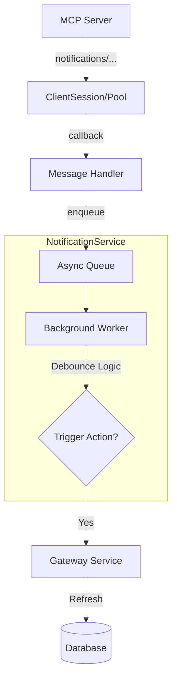

# ADR-034: Centralized Notification Service

- *Status:* Accepted
- *Date:* 2026-01-13
- *Deciders:* Platform Team

## Context

The Model Context Protocol (MCP) supports various server-to-client notifications that enable proactive communication and real-time updates. key notification types include:

| Notification Method                     | Direction         | Description                                                              | Typical Use Case                                     |
|----------------------------------------|-------------------|--------------------------------------------------------------------------|-----------------------------------------------------|
| notifications/initialized              | Client → Server   | Signals that the client has completed initialization.                    | After handshake, client ready to operate.           |
| notifications/tools/list_changed       | Server → Client   | Notifies the client that available tools on the server have changed.     | Client should refresh the tool list.                |
| notifications/resources/list_changed   | Server → Client   | Informs the client that available resources on the server have changed.  | Client should refresh resource list.                |
| notifications/resources/updated        | Server → Client   | Resource the client subscribed to has changed.                           | Client may re-read the resource.                    |
| notifications/prompts/list_changed     | Server → Client   | Server's prompts list changed.                                           | Client may refresh prompt templates list.           |
| notifications/roots/list_changed       | Client → Server   | Client informs server that its root set changed.                         | Server might request updated roots from client.     |
| notifications/message (logging)        | Server → Client   | Sends a log message (e.g., informational output from the server).        | Logging or debugging stream.                        |
| progress                               | Both → Both       | Updates progress on a long-running operation with a token.               | Streaming progress for long-running tasks.          |
| cancelled                              | Both → Both       | Indicates an in-progress request has been cancelled.                     | Cancelling a long-running operation.                |

---

Prior to this decision, the gateway lacked a unified mechanism to handle these notifications. Specifically:
1.  **Fragmented Handling:** Notification logic would otherwise be scattered across individual service methods or session implementations.
2.  **Session Pooling:** With the introduction of `MCPSessionPool`, sessions are long-lived and shared. A dedicated mechanism is needed to route notifications from these pooled connections back to the appropriate application context (e.g., triggering a refresh).
3.  **Refresh Storms:** Aggressive servers sending frequent `list_changed` notifications could trigger excessive database writes and upstream calls if not debounced.
4.  **Context Propagation:** Notifications arriving on a pooled session need to be correctly attributed to the originating `gateway_id` to perform actions like refreshing the correct gateway's schema.

## Decision

We have implemented a **Centralized Notification Service** (`NotificationService`) to act as the single hub for managing all MCP server notifications.

This service is designed to:
1.  **Centralize Routing:** Act as the destination for `message_handler` callbacks from `mcp-python-sdk`'s `ClientSession`.
2.  **Debounce Events:** Implement a configurable buffering strategy (default 5s) to coalesce rapid `list_changed` events into single refresh actions, protecting the gateway and database.
3.  **Manage Capabilities:** Track per-gateway capabilities (e.g., `tools.listChanged: true`) to know which gateways support event-driven updates.
4.  **Integrate with Pooling:** Seamlessly hook into `MCPSessionPool` to provide automatic notification handling for all pooled sessions without requiring changes to client code.

### Handling Other Notification Types

This centralized architecture is critical for supporting future notification types beyond `list_changed`:

- **Progress (`notifications/progress`):**
    - The centralized service can route progress tokens from backend tools to the client's request context.
    - It allows for aggregating progress from multiple parallel tool executions if needed.
- **Logging (`notifications/message`):**
    - Server logs can be intercepted centrally and piped into the gateway's observability stack (e.g., structured JSON logging, Prometheus counters).
    - Prevents log spam from reaching individual clients unless explicitly subscribed.
- **Cancellation (`notifications/cancelled`):**
    - Provides a central point to handle cancellation signals, allowing the gateway to terminate associated backend processes or cleanup resources even if the original request handler has detached.

## Changes Made

1.  **New Service: `mcpgateway/services/notification_service.py`**
    - Implements the `NotificationService` class with `asyncio.Queue` for processing.
    - Provides `create_message_handler(gateway_id)` factory for easy integration with SDK sessions.
    - Handles `tools/list_changed`, `resources/list_changed`, and `prompts/list_changed` with smart debouncing.

2.  **Session Pool Integration (`MCPSessionPool`)**
    - Automatically initializes the notification service on startup.
    - Injects the `message_handler` into every new `ClientSession` created by the pool.
    - ensures `gateway_id` context is passed during session creation.

3.  **Gateway Service Updates (`GatewayService`)**
    - Registers gateway capabilities with the notification service upon initialization.
    - Propagates `gateway_id` in health checks to ensure connectivity context is maintained.

4.  **Code Fixes**
    - Updated `tool_service.py`, `resource_service.py`, and `gateway_service.py` to explicitly pass `gateway_id` to `pool.session()` calls, ensuring notifications can be traced back to their source.

## Architecture Diagram

## Benefits

- **Scalability:** Debouncing prevents system overload from chatty servers.
- **Maintainability:** Single location for all notification logic. Adding support for `notifications/progress` or `notifications/message` will only require changes in this one service.
- **Consistency:** Ensures all pooled sessions behave identically regarding notifications.
- **Observability:** Centralized logging and metrics for all notification events (received, debounced, processed, failed).

## Consequences

### Positive
- Automatic schema synchronization for supported servers.
- Reduced database load compared to aggressive polling.
- Foundation laid for implementing real-time progress bars and log streaming in the future.

### Negative
- Adds stateful complexity (background worker task).
- Requires careful lifecycle management (startup/shutdown) to prevent resource leaks.
- Debugging decentralized events can be harder than synchronous flows (mitigated by extensive logging).
- Slightly reduced session reuse when gateway_id differs (sessions are now keyed by gateway_id for correct notification attribution).

## Alternatives Considered

- **Per-Session Handling:** Implementing logic directly in the session callback.
  - *Rejected:* Hard to debounce globally for a gateway if multiple sessions exist (though currently pooled by URL). Hard to unit test complex logic embedded in callbacks. Violates Single Responsibility Principle.
- **Polling Only:**
  - *Rejected:* Inefficient. High latency for discovering new tools, or high load if polling frequency is increased.

## References

- [MCP Protocol - Notifications](https://spec.modelcontextprotocol.io/spec/server/notifications/)
- Issue #1924: Pooled Session Implementation and #1984 Event driven list/spec refresh
- PR #2071 Centralized Notification System designed to work with session pooling
