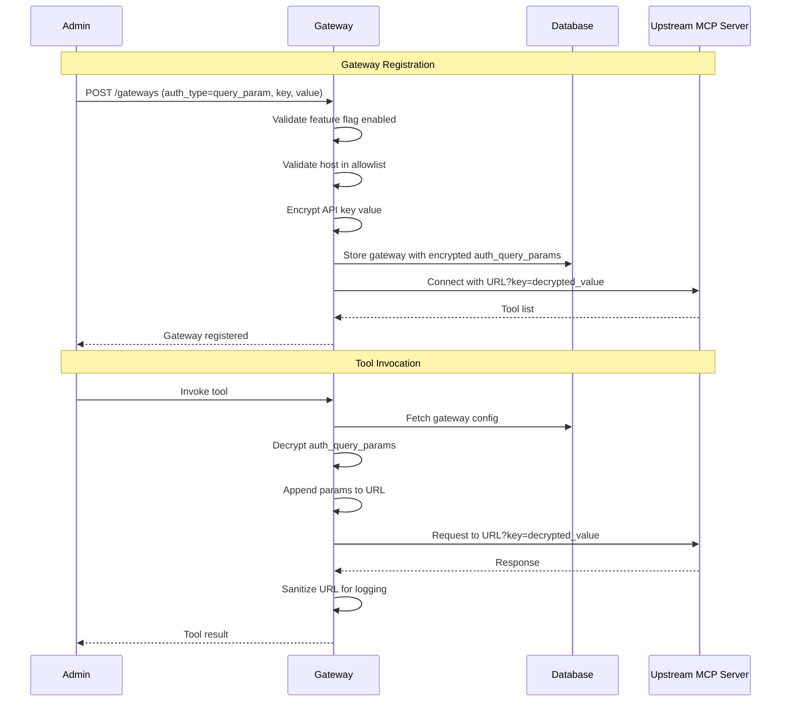

# ADR-035: Query Parameter Authentication for Gateway Peers

**Status:** Accepted
**Date:** 2026-01-19
**Deciders:** Architecture Team
**Technical Story:** [#1580](https://github.com/IBM/mcp-context-forge/issues/1580)

## Context and Problem Statement

Some upstream MCP servers (notably Tavily) require API key authentication via URL query parameters rather than HTTP headers. The existing authentication mechanisms in Context Forge Gateway (Basic, Bearer, OAuth, Custom Headers) all work through HTTP headers, making it impossible to connect to these services.

Users need to register and use MCP servers that mandate query parameter authentication for their API keys. Without this capability, the gateway cannot federate these services.

**How can we support upstream MCP servers that require API key authentication via URL query parameters while maintaining security best practices?**

## Decision Drivers

- **Compatibility requirement**: Support MCP servers that mandate query parameter authentication (e.g., Tavily)
- **Security requirement**: Minimize exposure of API keys in logs, history, and error messages
- **Principle of least surprise**: Make the security implications explicit to users
- **Defense in depth**: Provide multiple layers of protection (feature flag, host allowlist, log sanitization)
- **Backward compatibility**: Do not affect existing authentication workflows

## Considered Options

1. **Feature-Flagged Query Parameter Authentication** (Chosen)
2. URL Rewriting Middleware
3. Custom Transport Layer
4. Reject Query Parameter Authentication Entirely

## Decision Outcome

Chosen option: **"Feature-Flagged Query Parameter Authentication"**, because it provides the necessary functionality while making security trade-offs explicit through naming conventions (`INSECURE_` prefix), feature flags, and host allowlists.

### Implementation Details

The solution introduces query parameter authentication as a new `auth_type` for gateways with multiple security controls:

1. **Feature Flag**: `INSECURE_ALLOW_QUERYPARAM_AUTH` (default: `false`) - Must be explicitly enabled
2. **Host Allowlist**: `INSECURE_QUERYPARAM_AUTH_ALLOWED_HOSTS` - Restricts which upstream hosts can use this auth method
3. **Encrypted Storage**: API keys are encrypted at rest using the existing `AUTH_ENCRYPTION_SECRET`
4. **Log Sanitization**: All URLs are sanitized before logging to redact sensitive query parameters



### Security Architecture

```
┌─────────────────────────────────────────────────────────────────┐
│                     Security Controls                            │
├─────────────────────────────────────────────────────────────────┤
│  Layer 1: Feature Flag (INSECURE_ALLOW_QUERYPARAM_AUTH)         │
│           └─ Disabled by default, requires explicit opt-in      │
├─────────────────────────────────────────────────────────────────┤
│  Layer 2: Host Allowlist (INSECURE_QUERYPARAM_AUTH_ALLOWED_HOSTS)│
│           └─ Empty = any host, Non-empty = strict allowlist     │
├─────────────────────────────────────────────────────────────────┤
│  Layer 3: Encrypted Storage (AUTH_ENCRYPTION_SECRET)            │
│           └─ API keys encrypted at rest in database             │
├─────────────────────────────────────────────────────────────────┤
│  Layer 4: Log Sanitization (sanitize_url_for_logging)           │
│           └─ Sensitive params redacted before any logging       │
├─────────────────────────────────────────────────────────────────┤
│  Layer 5: UI Warning                                            │
│           └─ Explicit security warning in Admin UI              │
└─────────────────────────────────────────────────────────────────┘
```

### Technical Changes

- **Database**: Added `auth_query_params` JSON column to `gateways` table
- **Schemas**: Added `auth_query_param_key` and `auth_query_param_value` fields to GatewayCreate/Update
- **Config**: Added `insecure_allow_queryparam_auth` and `insecure_queryparam_auth_allowed_hosts` settings
- **Services**: Updated GatewayService, ToolService, ResourceService to handle query param auth
- **Utilities**: Created `mcpgateway/utils/url_auth.py` with `apply_query_param_auth()` and `sanitize_url_for_logging()`
- **Admin UI**: Added "Query Parameter (INSECURE)" option with security warning
- **Export/Import**: Support for exporting and importing gateways with query param auth

### Positive Consequences

- **Expanded Compatibility**: Gateway can now federate MCP servers requiring query parameter authentication
- **Explicit Security Trade-offs**: The `INSECURE_` prefix and UI warnings make risks clear to administrators
- **Defense in Depth**: Multiple layers of protection minimize exposure risk
- **Backward Compatibility**: Feature is opt-in and disabled by default
- **Consistent UX**: Follows the same patterns as other authentication types

### Negative Consequences

- **Inherent Security Risk**: API keys in URLs may appear in:
  - Proxy server logs (if not configured to redact query strings)
  - Browser history (if URLs are exposed to browsers)
  - Server access logs (upstream server's logs)
  - Network monitoring tools
- **CWE-598 Violation**: This authentication method violates security best practices (Use of GET Request Method With Sensitive Query Strings)
- **Operational Burden**: Administrators must ensure proxy servers and monitoring tools are configured to redact sensitive query parameters

## Pros and Cons of the Options

### Option 1: Feature-Flagged Query Parameter Authentication (Chosen)

**Description**: Add query parameter authentication as a new auth type with explicit security controls and warnings.

- **Good**, because it enables compatibility with services like Tavily
- **Good**, because security trade-offs are explicit (INSECURE_ prefix, warnings)
- **Good**, because multiple security layers minimize risk
- **Good**, because it's backward compatible and opt-in
- **Bad**, because it introduces an inherently insecure authentication method
- **Bad**, because it requires careful operational configuration

### Option 2: URL Rewriting Middleware

**Description**: Implement middleware that intercepts requests and rewrites URLs to add query parameters.

- **Good**, because it separates concerns from the gateway service
- **Bad**, because it adds complexity to the request pipeline
- **Bad**, because it's harder to maintain and debug
- **Bad**, because it doesn't solve the fundamental security issue

### Option 3: Custom Transport Layer

**Description**: Create a custom transport that handles query parameter injection.

- **Good**, because it isolates the functionality
- **Bad**, because it requires significant architectural changes
- **Bad**, because it duplicates existing transport logic
- **Bad**, because maintenance burden is higher

### Option 4: Reject Query Parameter Authentication Entirely

**Description**: Document that query parameter authentication is not supported and recommend users contact upstream providers.

- **Good**, because it maintains security posture
- **Bad**, because it excludes legitimate use cases
- **Bad**, because users cannot use services like Tavily
- **Bad**, because it reduces the gateway's utility

## Validation

The feature was tested and validated in the following scenarios:

- Gateway registration with query param auth (feature flag enabled)
- Gateway registration rejected (feature flag disabled)
- Gateway registration rejected (host not in allowlist)
- Tool invocation with query param auth applied to URL
- Resource fetch with query param auth applied to URL
- Log output verification (sensitive params redacted)
- Export/import of gateways with query param auth
- Admin UI form submission and display

## Links

- GitHub Issue: [#1580](https://github.com/IBM/mcp-context-forge/issues/1580)
- CWE-598: Use of GET Request Method With Sensitive Query Strings
- OWASP: Sensitive Data in URL Query String

## Notes

- The `INSECURE_` prefix follows the convention of making dangerous settings explicit
- Administrators should configure upstream proxies to redact query strings from access logs
- The host allowlist should be configured in production to limit exposure
- API keys are encrypted using the same mechanism as other authentication credentials
- The feature integrates with existing export/import functionality for backup/restore
