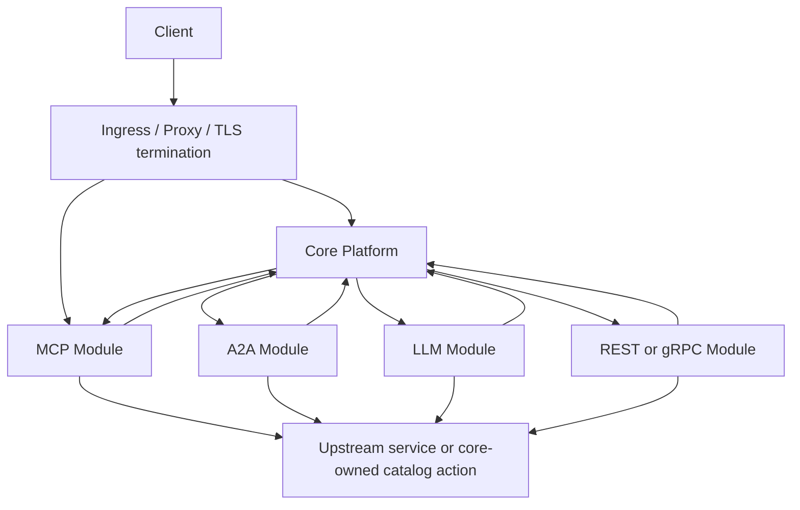
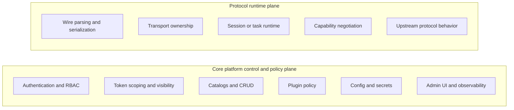
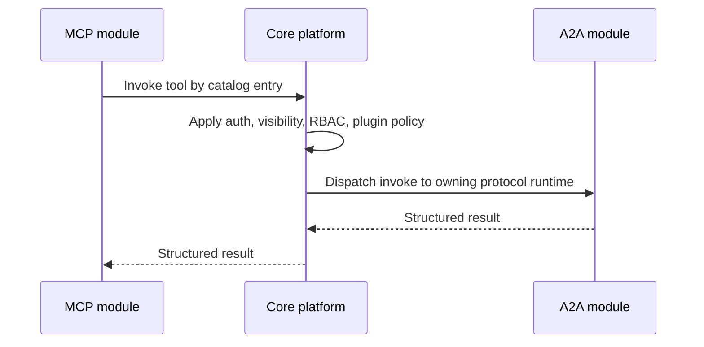

# ContextForge Modular Runtime Architecture

**Status:** Proposed target architecture and implementation entry point

This document defines the target-state modular runtime architecture for
ContextForge.

It is intended to support:

- the existing MCP gateway
- the existing A2A gateway
- future LLM gateway runtimes
- future REST and gRPC gateway runtimes
- implementations in different languages, including Python, Rust, and Go

## Purpose

ContextForge already contains multiple protocol-facing runtime paths inside one
Python application. The Rust MCP runtime proves that a protocol runtime can be
split out into a separate implementation while the core platform remains the
system of record for security and catalog state.

This specification generalizes that idea into a reusable architecture:

- a **core platform** that owns policy, persistence, catalogs, plugins, admin
  UI, and observability
- one or more **protocol modules** that own protocol wire behavior and
  transport or runtime semantics

The goal is not to rewrite the product. The goal is to create a stable
architecture that can evolve incrementally from the current codebase.

## Scope

This document is about **runtime decomposition**, not package layout.

It is complementary to
[ADR-019: Modular Architecture Split (14 Independent Modules)](adr/019-modular-architecture-split.md),
which is about packaging and repository structure.

This document deliberately distinguishes between:

- **implemented precedent**
  The current Rust MCP runtime sidecar and existing external plugin runtimes.
- **target architecture**
  The longer-term modular contract that future MCP, A2A, LLM, and REST or gRPC
  runtimes should follow.
- **migration guidance**
  The phased path from the current monolith to that target.

## Non-Goals

This specification does not:

- require a ground-up rewrite
- require all protocols to be extracted at once
- require all modules to be sidecars immediately
- freeze final protobuf package names or generated SDK layout
- replace protocol-specific documents such as
  [Rust MCP Runtime](rust-mcp-runtime.md)

## Relationship to Existing Architecture Docs

| Document | Role |
|----------|------|
| [Rust MCP Runtime](rust-mcp-runtime.md) | Describes the currently implemented MCP sidecar/runtime path and rollout modes |
| [ADR-043](adr/043-rust-mcp-runtime-sidecar-mode-model.md) | Records the implemented Rust MCP sidecar and mode model |
| [Multitenancy](multitenancy.md) | Defines team scoping and visibility rules that remain core-owned |
| [OAuth Design](oauth-design.md) | Defines auth and credential handling that remain core-owned |
| [Plugin Framework](plugins.md) | Defines plugin behavior that remains centrally configured and enforced by the core |

## How to Use This Specification

Use the documents in this order:

1. this page for the architectural rules and operating model
2. [Core SPI](modular-runtime/core-spi.md) for the module-to-core contract
3. [Module Descriptor](modular-runtime/module-descriptor.md) and
   [Module Lifecycle](modular-runtime/module-lifecycle.md) for module
   registration and startup behavior
4. [Error Model](modular-runtime/error-model.md) and
   [Conformance](modular-runtime/conformance.md) for compatibility and release
   requirements
5. the protocol profile for the module being implemented:
   - [MCP Module Profile](modular-runtime/mcp-module.md)
   - [A2A Module Profile](modular-runtime/a2a-module.md)
   - [LLM Module Profile](modular-runtime/llm-module.md)
   - [REST/gRPC Module Profile](modular-runtime/rest-grpc-module.md)

## Key Decisions

| Decision | Summary | Source |
|----------|---------|--------|
| Core owns policy; modules own protocol | Auth, RBAC, catalogs, plugins, persistence, and admin UI stay in the core; wire protocol and transport behavior move to modules | This document |
| Process boundary first | Sidecars are the default modular boundary; embedded runtimes are an optimization | This document |
| Default IPC transport | gRPC over Unix Domain Socket is the target-state module-to-core transport; HTTP/JSON remains an explicit fallback | [ADR-044](adr/044-module-communication-protocol.md) |
| Auth remains in core | Modules consume authenticated context; they do not become independent auth authorities | [ADR-045](adr/045-auth-remains-in-core.md) |
| Shared-nothing between modules | Modules do not import or call each other directly; cross-protocol behavior is mediated by the core | [ADR-046](adr/046-shared-nothing-between-modules.md) |
| Incremental migration | The architecture is adopted by refactoring the current system in phases, not by rewrite | [ADR-047](adr/047-incremental-migration-over-rewrite.md) |

## Current Implemented Precedent

ContextForge today is primarily a monolithic Python application, but two
existing patterns already prove the modular direction:

1. **Rust MCP runtime sidecar**
   The MCP streamable HTTP public path can run through a Rust sidecar while
   Python remains authoritative for auth, token scoping, and RBAC.
2. **External plugin runtimes**
   Plugins can already run out of process behind a language-neutral transport.

These are important precedents, but they are not yet the full target modular
contract.

In particular, the current Rust MCP runtime is a **transition architecture**:

- it is a real external runtime
- it proves sidecar deployment, direct ingress, and mode-based rollout
- it still contains performance-oriented implementation details that are more
  specific than the long-term generic module boundary

This document defines the steadier target boundary that future modules should
converge on.

## Implementation Status

The modular architecture is no longer purely speculative. One protocol module
is already implemented and validated.

| Protocol family | Module status | Notes |
|-----------------|---------------|-------|
| MCP | Implemented | Rust MCP runtime sidecar exists today with mode-based rollout and direct-ingress support |
| A2A | Not yet extracted | Current A2A runtime remains embedded in Python |
| LLM | Not yet extracted | Current LLM proxy and chat flows remain embedded in Python |
| REST/gRPC | Not yet extracted | Current virtualization and service-management flows remain embedded in Python |

The important consequence is that this spec is grounded in a working MCP module
rather than a hypothetical first extraction.

## Current Precedent vs Target State

The spec must be explicit about what is implemented today versus what future
modules should target.

| Topic | Implemented today | Target-state default |
|-------|-------------------|----------------------|
| First extracted runtime | Rust MCP sidecar | Additional protocol modules, potentially in Rust, Go, or Python |
| Sidecar transport to core | Narrow internal HTTP over local/private transport, including UDS or loopback depending on path | gRPC over UDS |
| Fallback transport | HTTP/JSON | HTTP/JSON |
| Ingress ownership | Both valid today: Python-owned ingress and direct Rust ingress depending on mode | Both valid patterns remain acceptable |
| Auth authority | Python core | Core platform |
| Plugin parity | Achieved through a mix of direct core-sensitive handling and selective delegation | Explicit SPI or core-delegation contract |
| Data-path optimizations | Rust MCP keeps targeted fast paths | Allowed, but must preserve contract and rollback behavior |

## Architecture Principles

1. **Core owns policy; modules own protocol.**
   The core platform owns security, persistence, catalogs, plugins,
   configuration, observability, and admin UI. Modules own transport, wire
   format, session/runtime semantics, capability negotiation, and upstream
   protocol behavior.

2. **Process boundary first.**
   The default modular boundary is a sidecar or sibling process. Embedded
   in-process runtimes are allowed where justified, but they are not the
   default design center.

3. **Language-neutral contracts.**
   Contracts between the core and modules must not depend on Python object
   identity, ORM models, or framework internals.

4. **Shared-nothing between modules.**
   Modules do not import or call one another directly. Cross-protocol behavior
   flows through the core.

5. **Compatibility and rollback first.**
   Each extraction step must preserve an operational rollback path.

6. **Incremental migration over rewrite.**
   The existing codebase remains the migration source; tests and behavior
   remain the regression oracle.

## Reference Model

The following diagram is logical, not strictly physical. A module may sit
behind core-managed routing or may own direct public ingress while still using
the core for policy and catalog decisions.

Two ingress patterns are valid:

1. `client -> ingress -> core -> module`
   Use when the core remains the public edge and the module is an internal
   runtime behind it.
2. `client -> ingress -> module -> core SPI`
   Use when the module owns the public protocol edge directly, as the Rust MCP
   runtime already does in `edge` and `full` mode.

### Responsibilities by Plane

## Core Platform Responsibilities

The core platform remains the common control plane and policy plane. The table
below is representative, not exhaustive.

| Responsibility | Notes |
|----------------|-------|
| Authentication | JWT verification, SSO integration, token normalization, revocation checks |
| Authorization | RBAC, team scoping, visibility filtering, deny-path behavior |
| Persistence | Database models, migrations, consistency, ownership metadata |
| Catalogs | Tools, resources, prompts, servers, gateways, agents, providers, and other core-owned records |
| CRUD and admin flows | Registration, update, delete, import/export, admin workflows |
| Plugin policy and configuration | Central plugin config, hook selection, hook execution policy |
| Prompt/completion/roots business services | Prompt rendering policy, completion services, roots services, and other catalog-backed non-wire operations |
| LLM and upstream provider control plane | Provider credentials, model configuration, policy-aware routing metadata |
| gRPC and REST control surfaces | Core-owned registration, exposure metadata, and governance for virtualized services |
| Observability | Traces, logs, metrics, audit signals, support bundles |
| Configuration and secrets | Global config precedence, secret resolution, encryption |
| Cross-protocol routing | Mediate calls between protocol modules through core-owned catalogs and services |
| Admin UI | Platform UI remains core-owned even when runtimes are modularized |

The core does **not** own protocol wire parsing, protocol transport semantics,
or protocol-specific session state machines once those are extracted into a
module.

## Protocol Module Responsibilities

Each protocol module owns protocol-facing runtime behavior for one protocol
family.

| Responsibility | Example |
|----------------|---------|
| Wire parsing and serialization | MCP JSON-RPC, A2A request envelopes, future LLM request formats |
| Protocol transport | streamable HTTP, SSE, WebSocket, stdio, long-poll, push channels |
| Runtime/session semantics | MCP session lifecycle, A2A task state handling, LLM chat session flow |
| Capability negotiation | MCP `initialize`, A2A capability advertisement, future provider capability declarations |
| Upstream protocol behavior | MCP upstream client pooling, A2A invocation behavior, LLM provider relay logic |
| Protocol-specific health and stats | Runtime-owned counters, transport stats, protocol-specific readiness |

Modules should not become independent sources of truth for security policy,
catalog ownership, or long-term persistence rules.

## Module Runtime Contract

The contract has three parts:

1. **module identity**
2. **module lifecycle**
3. **core SPI service families**

Those concrete documents live under [Modular Runtime Specification](modular-runtime/index.md).

### Module Identity

Every module should declare a stable descriptor with fields equivalent to:

- module id
- protocol family
- implementation language
- module version
- supported SPI version(s)
- runtime mode
  - embedded
  - sidecar
- exposed capabilities
- health and stats endpoints or RPCs

The exact wire schema is implementation detail. The architectural requirement
is that the core can discover what a module is, what contract version it
supports, and how to talk to it.

### Module Lifecycle

Every module should support these lifecycle phases:

1. **register**
   The module is discovered and its descriptor is loaded.
2. **initialize**
   The core provides configuration, scoped dependencies, and any required
   bootstrap state.
3. **ready**
   The module can accept live traffic.
4. **drain**
   The module stops accepting new work and lets in-flight work complete.
5. **shutdown**
   The module releases resources and exits cleanly.

At minimum, the core must be able to ask a module for:

- readiness
- liveness
- version and capability metadata
- runtime stats

### Core SPI Service Families

The exact API surface will evolve, but the module contract should be organized
around stable service families rather than one-off internal endpoints.

| Service family | What it provides |
|----------------|------------------|
| Auth and policy | Resolve caller context, validate authenticated identity, check permissions, enforce token-scoped visibility |
| Catalog read and invoke | List, fetch, and invoke tools, resources, prompts, agents, servers, gateways, providers, and related core-owned records through policy-aware services |
| Session and event services | Session lookup, ownership checks, replay/event access where the protocol requires shared session or event semantics |
| Plugin services | Execute or delegate plugin-sensitive pre/post operations under core-owned plugin policy |
| Observability | Trace context propagation, structured logging, audit events, module metrics publication |
| Configuration and secrets | Scoped config delivery, secret references, feature flags, core-provided defaults |
| Admin and health integration | Module stats, health, and optional descriptors the core UI can surface |

Two constraints are intentionally fixed:

- the architecture does **not** freeze exact final RPC names yet
- the architecture does **not** require one giant interface; multiple smaller
  service definitions are preferred

## Communication Model

### Default Transport

The target-state default module-to-core transport is:

- **gRPC over Unix Domain Socket**

Why:

- language-neutral
- streaming support
- well understood code generation story for Python, Rust, and Go
- suitable for host-local sidecar communication

This is the target-state default, not a claim about every implemented module
today. The current Rust MCP runtime is the main precedent and still uses a
mix of narrow internal HTTP over local/private transport depending on the path.

### Fallback Transport

The fallback transport is:

- **HTTP/JSON over loopback or internal network**

This is acceptable when:

- a gRPC toolchain is undesirable
- a runtime only needs request/response behavior
- an operator environment prefers plain HTTP for debugging or policy reasons

### Embedded Mode

Embedded modules may bypass serialization and call the same conceptual contract
directly in-process.

This is an optimization, not a different architecture.

### No Direct Module-to-Module Calls

Modules do not import or invoke each other directly.

Cross-protocol behavior must be mediated by the core.

Example:

That preserves language independence and keeps routing policy in one place.

## Security and Trust Model

The modular architecture does **not** distribute trust equally.

### Core-Owned Security Responsibilities

The core remains the source of truth for:

- authentication
- token scoping
- RBAC
- secret storage and decryption
- rate limiting policy
- audit and security logging

Modules may enforce the outcome of a core decision, but they do not become
independent security authorities.

### What Modules Receive

Modules should receive:

- a typed authenticated context
- permission decisions or permission-check APIs
- scoped resource visibility through catalog calls

Modules should **not** be expected to:

- interpret raw JWT claims as the source of truth
- fetch and decrypt stored credentials
- invent their own team-scoping semantics

### Trust Boundary for Sidecars

Sidecars must communicate with the core over a trusted local or private
channel. The deployment mechanism may vary, but the architectural
requirements are:

- the core can authenticate the module channel
- arbitrary external clients cannot call privileged core-internal module APIs
- channel permissions or network policy are explicit

## Cross-Protocol Mediation

ContextForge already has cross-protocol behaviors:

- A2A agents exposed as MCP tools
- LLM chat invoking MCP tools
- REST and gRPC services exposed as virtual servers or tools

In the modular architecture, those behaviors stay possible, but the routing
belongs to the core.

The core is responsible for:

- deciding which catalog entry is being invoked
- determining the owning protocol/runtime
- applying policy, plugin rules, and observability
- dispatching to the appropriate module

The key consequence is that modules remain isolated, while the product keeps a
single coherent governance model.

## Plugin Model

Plugins remain a core-owned concern.

That means:

- plugin configuration stays centralized
- the core defines which hooks run
- modules must preserve plugin parity on plugin-sensitive flows

There are two acceptable implementation patterns:

1. the module explicitly calls a core plugin SPI around the relevant operation
2. the module delegates a plugin-sensitive flow back to the core when parity
   requires it

This keeps plugin behavior consistent even when the fast path moves into a
different language.

## Deployment Patterns

The architecture supports three deployment patterns.

### 1. Monolithic / Embedded

The core and modules run in one process.

Use when:

- minimizing operational complexity
- migrating incrementally
- performance-sensitive in-process execution is justified

### 2. Hybrid

Some protocols remain embedded while others move into sidecars.

This is the current precedent with the Rust MCP runtime:

- Python remains the core
- MCP may run through a Rust sidecar
- A2A and other runtime paths remain embedded in Python

### 3. Full Sidecar Model

Multiple protocol runtimes run as separate processes, possibly in different
languages, while the core remains the shared control plane.

This is the long-term extensibility model for future A2A, LLM, and REST/gRPC
modules.

## Configuration Model

Configuration remains layered and core-owned.

The architecture should distinguish:

- **core-global settings**
  Shared platform settings such as auth, database, Redis, plugin config, and
  observability.
- **module-scoped settings**
  Protocol-specific runtime settings such as protocol version behavior,
  transport tuning, or runtime-specific timeouts.

Module-scoped settings should use explicit namespacing and should be delivered
through the module runtime contract rather than by relying on unrestricted
global process imports.

## Health, Failure, and Fallback

Every module should define:

- how it reports readiness and liveness
- how it reports degraded mode
- what happens if the core becomes unavailable
- what happens if the module becomes unavailable
- whether traffic can fall back to an embedded or legacy path

This is especially important for incremental rollout.

The current Rust MCP runtime already demonstrates this pattern through
mode-based rollout and rollback. Future modules should preserve the same
operational discipline.

## Testing and Release Requirements

Every protocol module should be expected to prove:

- contract compatibility with the core SPI
- protocol conformance for its protocol surface
- security deny paths
- fallback and rollback behavior
- plugin parity for plugin-sensitive flows
- performance and degradation characteristics appropriate to the protocol

Where a module introduces deployment-specific behavior, release validation
should also cover:

- compose or local stack validation
- Kubernetes or Helm validation where applicable
- upgrade and migration compatibility where applicable

The concrete target-state test matrix is defined in
[Conformance](modular-runtime/conformance.md).

## Migration Strategy

The migration is intentionally phased.

### Phase 0: Extract seams inside the monolith

Create clearer boundaries inside the current Python code:

- isolate protocol dispatch
- isolate policy and catalog boundaries
- reduce direct cross-service coupling where practical

### Phase 1: Define the core SPI

Define the first stable internal service families between core and modules.

At this stage, modules may still be embedded.

### Phase 2: Wrap existing runtimes behind module lifecycles

Make protocol runtimes conform to a common lifecycle and capability model even
before all traffic crosses an IPC boundary.

### Phase 3: Move selected runtimes to sidecars

Use sidecars where the performance, isolation, or language goals justify it.
The current Rust MCP runtime is the first concrete example of this phase.

### Phase 4: Add new protocol runtimes

Introduce new A2A, LLM, and REST/gRPC runtimes behind the same architectural
contract.

### Phase 5: Optimize

Only after the boundary is stable should the implementation optimize for:

- direct hot paths
- embedded fast paths
- selective caching and event-stream ownership

## What Is Decided vs What Is Still Open

### Decided in principle

- ContextForge should evolve toward a core-plus-modules runtime model.
- The core remains the policy and control plane.
- Modules are language-agnostic and process-boundary first.
- Shared-nothing between modules is a design rule.
- Incremental migration is the preferred path.

### Still intentionally open

- exact final SPI RPC names
- exact protobuf package layout
- exact module descriptor wire schema
- whether all plugin hooks are always explicit SPI calls versus selective core
  delegation for parity-sensitive flows
- how much direct data-path optimization a module may keep before it must be
  expressed through the generic SPI

## Open Questions

- What is the minimal first stable SPI version that supports both MCP and A2A
  without overfitting to either?
- Which cross-module events deserve an event bus rather than synchronous
  core-mediated routing?
- How should optional protocol surfaces be classified in release gating versus
  follow-up compatibility work?
- What is the right balance between generic SPI purity and targeted fast paths
  for performance-sensitive runtimes?

## Related Documents

- [Modular Runtime Specification](modular-runtime/index.md)
- [Rust MCP Runtime](rust-mcp-runtime.md)
- [ADR-043: Rust MCP Runtime Sidecar with Mode-Based Rollout](adr/043-rust-mcp-runtime-sidecar-mode-model.md)
- [ADR-044: Module Communication Protocol](adr/044-module-communication-protocol.md)
- [ADR-045: Authentication and Authorization Remain in Core](adr/045-auth-remains-in-core.md)
- [ADR-046: Shared-Nothing Between Protocol Modules](adr/046-shared-nothing-between-modules.md)
- [ADR-047: Incremental Migration Over Rewrite](adr/047-incremental-migration-over-rewrite.md)
- [ADR-019: Modular Architecture Split (14 Independent Modules)](adr/019-modular-architecture-split.md)
- [Multitenancy](multitenancy.md)
- [OAuth Design](oauth-design.md)
- [Plugin Framework](plugins.md)
