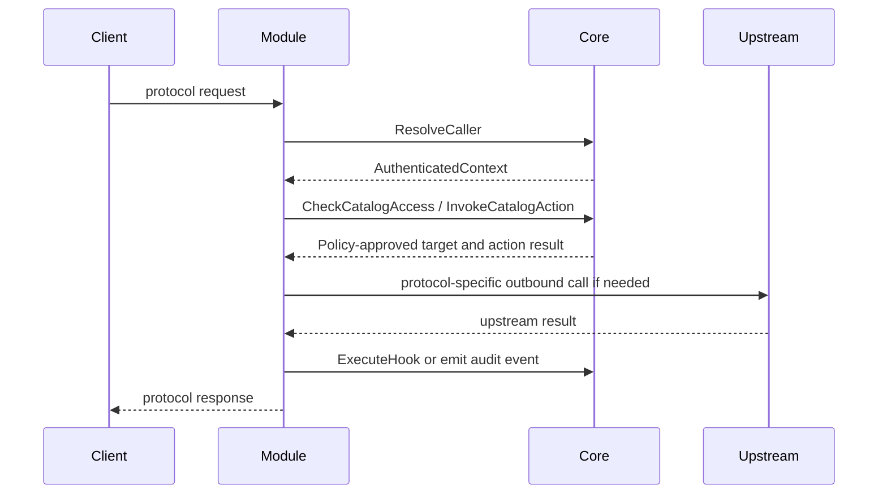

# Core SPI

This document defines the target-state service families between the core
platform and a protocol module.

The preferred transport is gRPC over UDS. During transition, HTTP/JSON over a
trusted local channel is also acceptable. The information model below is what
matters.

## Design Rules

- Modules do not read the database directly as their primary source of truth.
- Modules do not interpret raw JWT claims as authoritative policy.
- Modules do not fetch or decrypt stored credentials directly.
- Modules call the core for policy-sensitive catalog access.
- Modules may keep protocol-local caches, but cache invalidation still follows
  core-owned rules.

## Service Families

### Suggested First-Cut IDL Package Layout

The architecture does not freeze final generated package names, but a new
module should assume a layout equivalent to:

- `core.spi.auth.v1`
- `core.spi.catalog.v1`
- `core.spi.plugin.v1`
- `core.spi.session.v1`
- `core.spi.config.v1`
- `core.spi.observability.v1`

This is a useful planning baseline for a Rust A2A module or a Go LLM proxy
module even if the exact final packages evolve.

### AuthPolicyService

Provides authenticated context and permission decisions.

Required operations:

- `ResolveCaller`
- `CheckPermission`
- `CheckCatalogAccess`
- `ValidateSessionBinding`

Illustrative request and response shapes:

```json
{
  "resolveCallerRequest": {
    "transport": "streamable_http",
    "headers": {"authorization": "Bearer ..."},
    "clientIp": "203.0.113.10",
    "requestedServerId": "server-123"
  }
}
```

```json
{
  "authenticatedContext": {
    "subject": {
      "userEmail": "alice@example.com",
      "isAdmin": false,
      "tokenTeams": ["team-alpha"]
    },
    "visibilityScope": {
      "serverId": "server-123",
      "permissions": ["tools.read", "resources.read"],
      "ipRestrictions": [],
      "timeRestrictions": {}
    },
    "trace": {
      "requestId": "req-123",
      "correlationId": "corr-456"
    }
  }
}
```

The important invariant is semantic, not syntactic:

- `tokenTeams = null` and `isAdmin = true` means unrestricted admin context
- `tokenTeams = []` means public-only visibility
- team membership and visibility must use the same normalization as the core

### CatalogService

Provides policy-aware access to core-owned records.

Required operation classes:

- list records
- fetch one record
- invoke a record-backed action
- subscribe to record-change streams where the protocol needs them

Representative entity families:

- tools
- resources
- prompts
- agents
- servers
- gateways
- LLM providers and models
- roots

Illustrative list request:

```json
{
  "listCatalogRequest": {
    "entityType": "prompt",
    "serverId": "server-123",
    "authenticatedContextRef": "ctx-abc",
    "filters": {
      "activeOnly": true
    }
  }
}
```

Illustrative invoke request:

```json
{
  "invokeCatalogRequest": {
    "entityType": "tool",
    "entityId": "tool-123",
    "serverId": "server-123",
    "authenticatedContextRef": "ctx-abc",
    "arguments": {
      "timezone": "UTC"
    }
  }
}
```

### PluginService

Modules must preserve plugin parity on plugin-sensitive flows.

Two allowed patterns:

1. explicit hook execution through the SPI
2. full delegation of a parity-sensitive flow back to the core

Required hook classes:

- pre-fetch
- post-fetch
- pre-invoke
- post-invoke
- request or response mutation where the product already supports it

Illustrative hook call:

```json
{
  "executeHookRequest": {
    "hook": "resource_post_fetch",
    "entityType": "resource",
    "entityName": "time://formats",
    "serverId": "server-123",
    "authenticatedContextRef": "ctx-abc",
    "payload": {
      "contents": [{"uri": "time://formats", "mimeType": "text/plain", "text": "UTC"}]
    }
  }
}
```

### SessionEventService

Needed for protocols with shared session or task state.

Required when the protocol needs:

- stable session ownership
- replay or resume
- distributed event history
- ownership validation across workers

Representative operations:

- `CreateSession`
- `GetSession`
- `ValidateSessionOwner`
- `AppendEvent`
- `ReplayEvents`
- `DeleteSession`

### ConfigSecretsService

Provides module-scoped configuration and secret references.

Required capabilities:

- get module config
- resolve core-managed feature flags
- resolve secret references to a usable form without exposing unrelated secrets

Modules should receive only the settings they need, not a whole-process
configuration dump.

### ObservabilityService

Provides structured platform integration.

Required capabilities:

- emit structured logs
- publish counters and histograms
- attach trace context
- emit audit events

Modules may expose protocol-local metrics, but the core remains the system of
record for shared operational visibility.

## Minimum Service-Family Matrix

| Module family | Required service families | Usually optional |
|---------------|---------------------------|------------------|
| MCP | AuthPolicy, Catalog, Plugin, SessionEvent, Observability, ConfigSecrets | Additional module-local optimizations |
| A2A | AuthPolicy, Catalog, Observability, ConfigSecrets | Plugin, SessionEvent |
| LLM | AuthPolicy, Catalog, Observability, ConfigSecrets | Plugin, SessionEvent |
| REST/gRPC | AuthPolicy, Catalog, Observability, ConfigSecrets | Plugin, SessionEvent |

## Authenticated Context

Every SPI call that depends on caller identity should carry either:

- a full authenticated context
- a short-lived authenticated-context reference issued by the core

The minimum fields are:

- user identity
- admin status
- normalized token team state
- effective server scope if one is already known
- permission or scope restrictions attached to the token
- request and trace correlation identifiers

## Invocation Envelope

All invoke-style operations should preserve the same conceptual envelope:

- target record
- effective server or gateway context
- authenticated context reference
- input arguments
- trace metadata
- optional delegation hints

That allows a Rust A2A module and a Go LLM module to call the same core
services without inventing a protocol-specific policy seam.

## Typical Flow



## Versioning

The SPI must be explicitly versioned.

Rules:

- the core declares supported SPI versions
- the module declares supported SPI versions
- incompatible versions fail at startup
- additive changes are preferred
- protocol capability negotiation is separate from SPI version negotiation
