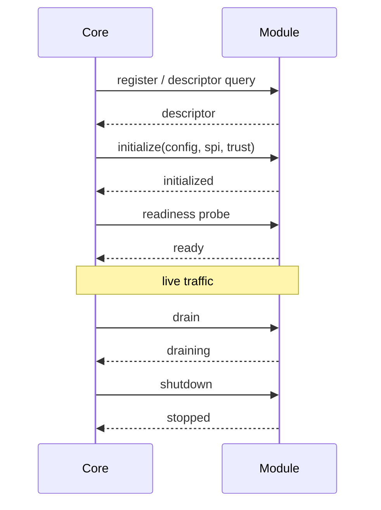

# Module Lifecycle

Every module must support the same lifecycle phases, regardless of language.

## Lifecycle Phases

1. **register**
   The core discovers the module and reads its descriptor.
2. **initialize**
   The core provides module-scoped configuration, trust material, and SPI
   connection information.
3. **ready**
   The module is healthy and can accept live traffic.
4. **drain**
   The module stops accepting new work and lets in-flight work complete.
5. **shutdown**
   The module releases resources and exits cleanly.

## Lifecycle Sequence

## Initialize Payload

The initialize payload should include:

- module-scoped configuration
- supported SPI version selected by the core
- how to reach the core SPI
- trace and observability configuration
- any trusted channel or module authentication material
- deployment mode
- explicit fallback expectations

It should not include unrestricted access to the core configuration model.

## Readiness Semantics

A module is not ready merely because the process is listening.

Ready means:

- descriptor is loaded
- configuration was accepted
- SPI compatibility was established
- any required warmup completed
- the module can enforce required deny paths safely

## Drain Semantics

Drain should:

- reject new live traffic
- keep ownership checks and in-flight responses correct
- preserve resumable or replayable state where the protocol requires it
- expose a clear draining status to the core

## Failure Rules

- If SPI compatibility fails, startup must fail before traffic.
- If the core becomes unavailable, the module must report degraded state.
- If the module cannot preserve protocol correctness safely, it must fail
  closed or trigger rollback rather than continue in a partial-trust mode.

## Rollback Requirement

Every production-facing extracted module should document:

- whether rollback to legacy or embedded path exists
- how rollback is triggered
- what state must be preserved during rollback
