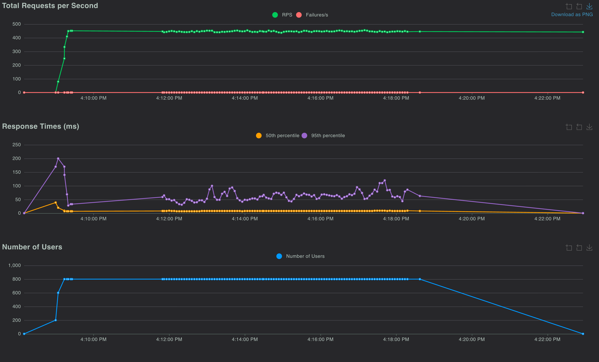

# Local - lite load testing and monitoring

---

## Quick Start Commands

## Step-1: (Skip if you are using linux running docker engine)

### Colima Setup : 10 CPU / 18GB

```bash
# Start colima with 10 cpu and 18gb memory
colima start --cpu 10 --memory 18

# Check with colima status
colima list
# TERMINAL OUTPUT -
PROFILE    STATUS     ARCH       CPUS    MEMORY    DISK      RUNTIME    ADDRESS
default    Running    aarch64    10      18GiB     100GiB    docker
```

### Step-2: Application setup , load testing and monitoring setup.

```bash
# Create production docker image
make docker-prod

# Note: Refer docker-compose.override.lite.yml for cpu and memory allocation
# Run lite replicas (uses docker compose)
make compose-lite-down && make compose-lite-up
# Access the gateway via proxy - http://localhost:8080

# Run lite monitoring (Not running pgadmin and redis commander)
make monitoring-lite-down && make monitoring-lite-up
# Access monitoring - http://localhost:3000

# Start load test UI (Runs on local host)
make load-test-ui
# Access locust - http://localhost:8089 and run the test
    # Concurreny = 800
    # Ramp up = 100
    # Run Time - 10m
    # uncheck FastTestEchoUser & FastTestTimeUser

```

**Note:** The lite commands (`make compose-lite-up/down` and `make monitoring-lite-up/down`) apply the `docker-compose.override.lite.yml` override file for reduced resource limits.

---

### Gateway Lite Service

| Aspect                 | Original (docker-compose.yml) | Lite (docker-compose.override.lite.yml) | Reason                                  |
| ---------------------- | ----------------------------- | ------------------------------ | --------------------------------------- |
| **Replicas**           | 3                             | 2                              | Reduce resource footprint for Colima    |
| **CPU Limit**          | 8 CPUs per replica            | 3.5 CPUs per replica           | More reasonable for 10 CPU host         |
| **CPU Reservation**    | 4 CPUs per replica            | 2 CPUs per replica             | Allows flexible burst up to limit       |
| **Memory Limit**       | 8GB per replica               | 3GB per replica                | Colima memory efficiency                |
| **Memory Reservation** | 4GB per replica               | 2.5GB per replica              | Leaves headroom for other services      |
| **Total Gateway Only** | 24 CPUs / 24GB (limits)       | 7 CPUs / 6GB (limits)          | 71% CPU reduction, 75% memory reduction |
|                        | 12 CPUs / 12GB (reservations) | 4 CPUs / 5GB (reservations)    |                                         |

### HTTP Server Selection

Both use **Gunicorn** (battle-tested, lower memory than Granian)

- 24 workers per replica (matches CPU cores)
- Connection pooling via PgBouncer

### Database Layer (PostgreSQL + PgBouncer)

| Service    | CPU Limit | Memory Limit | Reservation CPU | Reservation Memory |
| ---------- | --------- | ------------ | --------------- | ------------------ |
| PostgreSQL | 2 CPUs    | 4GB          | 1 CPU           | 2GB                |
| PgBouncer  | 1 CPU     | 256MB        | 0.5 CPU         | 128MB              |

No changes between versions - both tuned for 3000 concurrent users.

### Cache (Redis)

| Aspect                 | Original | Lite     |
| ---------------------- | -------- | -------- |
| **CPU Limit**          | 2 CPUs   | 1.5 CPUs |
| **Memory Limit**       | 2GB      | 1.5GB    |
| **CPU Reservation**    | 1 CPU    | 0.75 CPU |
| **Memory Reservation** | 1GB      | 0.75GB   |

---

## Resource Allocation: Old vs New

### Understanding Limits vs Reservations

- **Limits** = Hard ceiling (Docker throttles) - can exceed available CPU
- **Reservations** = Soft guarantee - **must fit in available CPU**
- **Actual Usage** = Real consumption (typically 30-50% of limits)

**Safety:** Limits can exceed 10 CPU because containers don't hit them simultaneously. Docker throttles (not crashes).

### Safety Verdict ✅

| Config                | CPU Reserved     | Memory Reserved | Status           |
| --------------------- | ---------------- | --------------- | ---------------- |
| **compose-lite-up**   | 6.75 CPU (67.5%) | 8.125GB (45%)   | ✅ SAFE          |
| **+ monitoring-lite** | 8.75 CPU (87.5%) | 9.625GB (53%)   | ✅ SAFE          |
| **Actual peak load**  | 4.6 CPU (46%)    | 5.25GB (29%)    | ✅ Good headroom |

**Original compose-up:** 12 CPU reserved (120% of 10 CPU) ❌ Won't schedule

---

## Resource Breakdown (Verified Against docker-compose.override.lite.yml)

**compose-lite-up (core only):**

```
Nginx:       0.5 CPU / 256MB reservation
Gateway(2×): 4.0 CPU / 5GB reservation
PostgreSQL:  1.0 CPU / 2GB reservation
PgBouncer:   0.5 CPU / 128MB reservation
Redis:       0.75 CPU / 0.75GB reservation
─────────────────────────────────────
Total:       6.75 CPU / 8.125GB ✅
```

**+ monitoring-lite (10 services):**

```
prometheus:         0.25 CPU / 256MB
grafana:            0.25 CPU / 256MB
loki:               0.25 CPU / 256MB
tempo:              0.25 CPU / 256MB
promtail:           0.25 CPU / 128MB
cadvisor:           0.25 CPU / 128MB
postgres_exporter:  0.125 CPU / 64MB
redis_exporter:     0.125 CPU / 64MB
pgbouncer_exporter: 0.125 CPU / 64MB
nginx_exporter:     0.125 CPU / 64MB
─────────────────────────────────────
Additional:  2.0 CPU / 1.5GB
Grand Total: 8.75 CPU / 9.625GB ✅ (87.5% utilization, 1.25 CPU headroom)
```

---

## make compose-lite-up : Services

**Included:**

- ✅ Nginx (caching proxy)
- ✅ Gateway (2 replicas)
- ✅ PostgreSQL 18
- ✅ PgBouncer (connection pooler)
- ✅ Redis (cache)

**Use Case:** Fast, lightweight local load testing without observability overhead

---

### make monitoring-lite-up: Services

**Included:**

- ✅ Prometheus (metrics collection)
- ✅ Grafana (dashboards)
- ✅ Loki (log aggregation)
- ✅ Tempo (distributed tracing)
- ✅ Promtail (log shipper)
- ✅ postgres_exporter (DB metrics)
- ✅ redis_exporter (cache metrics)
- ✅ pgbouncer_exporter (pool metrics)
- ✅ nginx_exporter (proxy metrics)
- ✅ cAdvisor (container metrics)

**Excluded (vs. monitoring profile):**

- ❌ pgAdmin (0.5 CPU / 256MB) - Disabled for Colima
- ❌ redis_commander (0.25 CPU / 128MB) - Disabled for Colima

**Resource Savings:** 0.75 CPU / 384MB by excluding admin tools

**Use Case:** Full observability (metrics, logs, traces) without admin UIs for local load testing.

---

### Original Profiles (Not for 10 CPU Colima/ Docker Engine)

| Profile           | Resources                  | Issue                           |
| ----------------- | -------------------------- | ------------------------------- |
| **compose-up**    | 12 CPU / 12GB reserved     | 120% of 10 CPU - won't schedule |
| **monitoring-up** | + pgAdmin, redis_commander | Further overprovisioned         |

---

## Performance Characteristics & Actual Usage

### Throughput Capacity

| Configuration             | RPS     | Users | Failure Rate |
| ------------------------- | ------- | ----- | ------------ |
| compose-lite (2 replicas) | 400-500 | 800   | ~0%          |

**Note:** Database (PostgreSQL max_connections=800) is the bottleneck, not CPU.

### Load test summary(800 users, 100 ramp rate, 10minutes)

**Overall Metrics:**

- Total Requests: 266,151
- Total Failures: 2 (0.00%)
- Requests/sec (RPS): 444.86

**Response Times (ms):**

- Average: 25.60
- Min: 0.92
- Max: 30011.87
- Median (p50): 8.00
- p90: 26.00
- p95: 60.00
- p99: 220.00

# Lite local load test



---

## Monitoring-Lite vs Full Monitoring Comparison

| Feature                | monitoring-lite | Full monitoring | Reason                                            |
| ---------------------- | --------------- | --------------- | ------------------------------------------------- |
| **Prometheus**         | ✅              | ✅              | Metrics collection (both have)                    |
| **Grafana**            | ✅              | ✅              | Dashboards (both have)                            |
| **Loki**               | ✅              | ✅              | Log aggregation (both have)                       |
| **Tempo**              | ✅              | ✅              | Distributed tracing (both have)                   |
| **Promtail**           | ✅              | ✅              | Log shipper (both have)                           |
| **cAdvisor**           | ✅              | ✅              | Container metrics (both have)                     |
| **postgres_exporter**  | ✅              | ✅              | DB metrics (both have)                            |
| **redis_exporter**     | ✅              | ✅              | Cache metrics (both have)                         |
| **pgbouncer_exporter** | ✅              | ✅              | Pool metrics (both have)                          |
| **nginx_exporter**     | ✅              | ✅              | Proxy metrics (both have)                         |
| **pgAdmin**            | ❌              | ✅              | Admin UI - excluded from lite for resource saving |
| **redis_commander**    | ❌              | ✅              | Admin UI - excluded from lite for resource saving |

**When to use each:**

- **`make monitoring-lite-up`** - Local load testing on Colima/Docker Desktop (same observability stack, just excludes admin UIs)
- **`make monitoring-up`** - Full monitoring including pgAdmin and redis_commander admin UIs (requires full docker-compose.yml)
