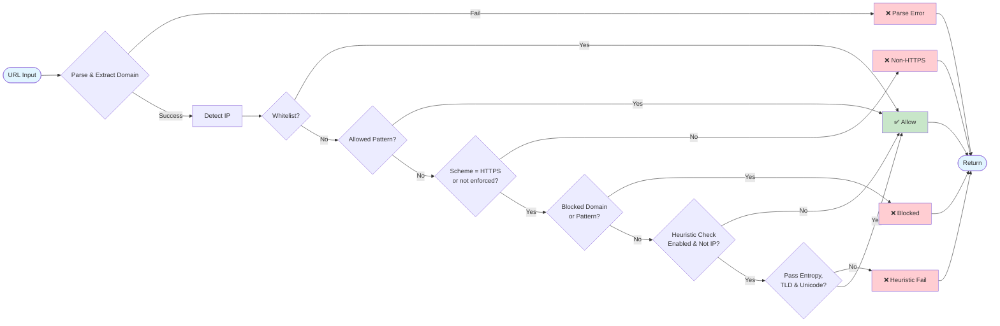

# URL Reputation (Rust)
> Author: Matheus Cafalchio
> Version: 0.1.0

Blocks URLs based on configured blocked domains, patterns and heuristics before resource fetch. Designed for fast and efficient resource checks.


## Hooks
- resource_pre_fetch – triggered before any resource is fetched.

## Config
```yaml
config:
    whitelist_domains: ["ibm.com", "yourdomain.com"]
    allowed_patterns: ["^https://trusted\\.internal/.*"]
    blocked_domains: ["malicious.example.com"]
    blocked_patterns: ["casino", "crypto"]
    use_heuristic_check: true
    entropy_threshold: 3.65
    block_non_secure_http: true
```
## Config Description

* **whitelist_domains**
  - A set of domains that are allowed to be fetched without any checks.

* **allowed_patterns**
  - A list of regex patterns matched against the full URL. If any pattern matches, the URL is allowed and skips all remaining checks — including the non-secure HTTP check. Evaluated after the whitelist, before scheme enforcement.

* **blocked_domains**
  - A set of domains that will always be blocked.

* **blocked_patterns**
  - A list of regex patterns matched against the full URL. If any pattern matches, the URL is blocked.

* **use_heuristic_check**
  - Whether heuristic checks (entropy, TLD validity, unicode security) should be performed. Default: `false`.

* **entropy_threshold**
  - Maximum allowed Shannon entropy for a domain. Higher entropy may indicate suspicious/malicious domains.

* **block_non_secure_http**
  - Whether URLs using `http` (non-secure) should be blocked. Default: `true`.

## Architecture



## Logic workflow

1. **Parse & Normalize URL**
   - Trim the input URL, then parse it (scheme and host are normalised to lowercase by the URL parser per RFC 3986; path and query retain original casing).
   - **Fail → Violation:** `"Could not parse url"`.

2. **Extract Domain**
   - Get the host string from the URL.
   - **Fail → Violation:** `"Could not parse domain"`.

3. **Detect IP Address**
   - Determine if domain is an IPv4 or IPv6 address.
   - Skip heuristic checks for IPs.

4. **Whitelist Check**
   - If domain is in `whitelist_domains` → **continue_processing = true**, skip all further checks.

5. **Allowed Patterns Check**
   - If URL matches any regex in `allowed_patterns` → **continue_processing = true**, skip all further checks.
   - Note: this check runs _before_ scheme enforcement, so an `allowed_patterns` match can bypass the non-secure HTTP block.

6. **Block Non-Secure HTTP**
   - If scheme ≠ `"https"` **and** `block_non_secure_http` → **Violation:** `"Blocked non secure http url"`.

7. **Blocked Domains**
   - If domain is in `blocked_domains` → **Violation:** `"Domain in blocked set"`.

8. **Blocked Patterns**
   - If URL matches any regex in `blocked_patterns` → **Violation:** `"Blocked pattern"`.

9. **Heuristic Checks** *(only for non-IP domains and if `use_heuristic_check = true`)*:
   9.1 **High Entropy Check** – If Shannon entropy > `entropy_threshold` → **Violation:** `"High entropy domain"`.
   9.2 **TLD Validity Check** – Validate top-level domain. Fail → **Violation:** `"Illegal TLD"`.
   9.3 **Unicode Security Check** – Validate domain unicode. Fail → **Violation:** `"Domain unicode is not secure"`.

10. **Final Outcome**
    - If no violations → **continue_processing = true**.
    - If any check fails → return first `PluginViolation` and **continue_processing = false**.


## Limitations

    - Static lists only; no external reputation providers.
    - Ianna valid TLDs are static and will be out of date
    - Ignores other schemes that are not http and https
    - No external domain reputation checks

## TODOs
    - External threat-intel integration with cache – Query external feeds for known malicious domains.
    - IP address handling policy – Decide rules for IPv4/IPv6 URLs.
    - Dynamic TLD updates – Fetch latest IANA TLD list automatically.


## Tests

**Test Coverage** (24 unit tests, all passing):

| Filename | Function Coverage | Line Coverage | Region Coverage |
|--------------------------|-------------------|-----------------|-----------------|
| engine.rs | 96.55% (28/29) | 99.26% (533/537) | 98.60% (634/643) |
| filters/heuristic.rs | 100.00% (5/5) | 96.49% (55/57) | 97.53% (79/81) |
| filters/patterns.rs | 100.00% (5/5) | 100.00% (20/20) | 100.00% (38/38) |
| lib.rs | 0.00% (0/1) | 0.00% (0/5) | 0.00% (0/7) |
| types.rs | 50.00% (3/6) | 44.12% (15/34) | 23.94% (17/71) |
| **TOTAL** | **89.13% (41/46)** | **95.43% (627/657)** | **91.45% (770/842)** |

*Note: `lib.rs` and `types.rs` contain PyO3 bindings and module declarations not covered by unit tests.*

**New test coverage includes:**
- Invalid regex pattern handling (both allowed and blocked patterns)
- Case-insensitive domain matching (whitelist and blocklist)
- Subdomain matching validation

**Run tests:**
```bash
cargo test --lib              # Run all unit tests
cargo llvm-cov --lib --html   # Generate coverage report
```

## Heuristic methods

The heuristics were based on a research paper.

    A. P. S. Bhadauria and M. Singh, "Domain‑Checker: A Classification of Malicious and Benign Domains Using Multitier Filtering," Springer Nature, 2023.
