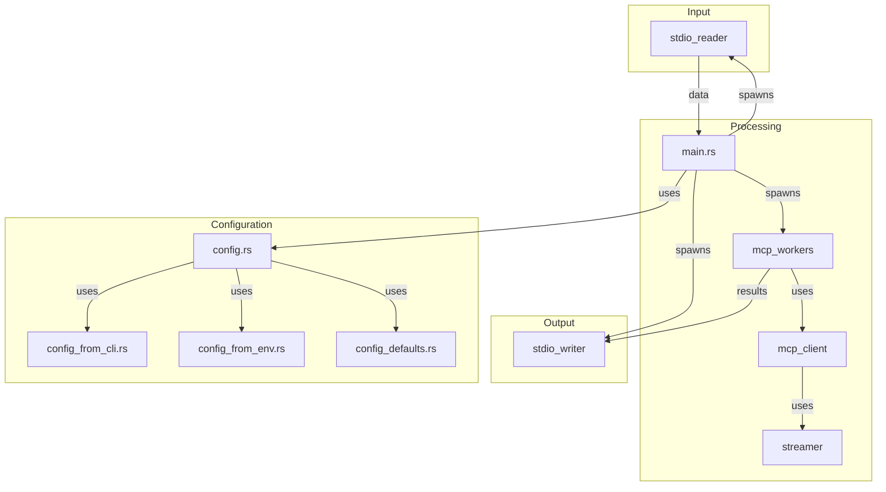
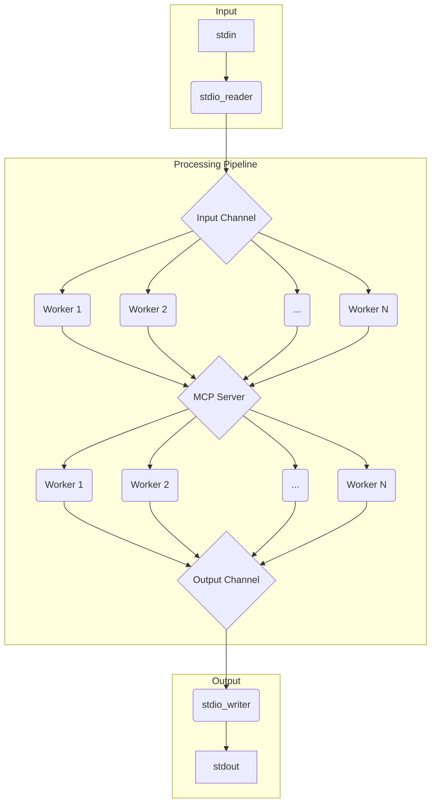

# mcp-stdio-wrapper

This project is a pipeline-oriented command-line tool designed to process data. It reads input from standard in (`stdin`), processes this data concurrently using a system of workers, and then writes the results to standard out (`stdout`).

The core functionality involves an `McpStreamClient` (defined in `src/streamer.rs`) which is used by `mcp_workers.rs` to send processed data to an external service. It also handles receiving Server-Sent Events (SSE) in response from this external service. The application's configuration is managed through `src/config.rs`, which integrates settings from command-line arguments and environment variables.

## Collaboration Diagram

Here is a high-level overview of the module collaboration:



## Logic Diagram

Here is a diagram showing the logic of the utility:


## Testing

To verify the functionality of the `mcp-stdio-wrapper`, you can use the provided test scripts in the `scripts/` directory.
Start gateway with:
```
make compose-up
```
before running test scripts.

### `test-fast-time-curl.sh`

This script directly interacts with the virtual server of the MCP Gateway using `curl`. It's useful for verifying that the MCP Gateway is running and responding as expected.

```bash
./scripts/test-fast-time-curl.sh
```

### `test-fast-time-wrapper.sh`

By default, the test scripts run against the release version of the `mcp-stdio-wrapper`. If you need to test a development version, you must update the executable path within the relevant test script to point to your development build.

This script utilizes the `mcp-stdio-wrapper` to send requests to the MCP Gateway. It demonstrates how the wrapper processes input and communicates with the gateway.

```bash
./scripts/test-fast-time-wrapper.sh
```


```

**Note** Update the PORT and SERVER_ID variables at the top of each script to match your environment, or set them as environment variables before execution.
